# 38.Grafana

前面我们使用 Prometheus 采集了 Kubernetes 集群中的一些监控数据指标，我们也尝试使用 promQL 语句查询出了一些数据，并且在 Prometheus 的 Dashboard 中进行了展示，但是明显可以感觉到 Prometheus 的图表功能相对较弱，所以一般情况下我们会一个第三方的工具来展示这些数据，今天我们要和大家使用到的就是 [Grafana](http://grafana.com/)。

Grafana 是一个可视化面板，有着非常漂亮的图表和布局展示，功能齐全的度量仪表盘和图形编辑器，支持 Graphite、zabbix、InfluxDB、Prometheus、OpenTSDB、Elasticsearch 等作为数据源，比 Prometheus 自带的图表展示功能强大太多，更加灵活，有丰富的插件，功能更加强大。


## 安装

同样的我们将 grafana 安装到 Kubernetes 集群中，第一步去查看 grafana 的 docker 镜像的介绍，我们可以在 dockerhub 上去搜索，也可以在官网去查看相关资料，镜像地址如下：[https://hub.docker.com/r/grafana/grafana/](https://hub.docker.com/r/grafana/grafana/)，我们可以看到介绍中运行 grafana 容器的命令非常简单：

```shell
$ docker run -d --name=grafana -p 3000:3000 grafana/grafana
```

但是还有一个需要注意的是 Changelog 中 v5.1.0 版本的更新介绍：

```
Major restructuring of the container
Usage of chown removed
File permissions incompatibility with previous versions
user id changed from 104 to 472
group id changed from 107 to 472
Runs as the grafana user by default (instead of root)
All default volumes removed
```

特别需要注意第 3 条，`userid` 和 `groupid` 都有所变化，所以我们在运行的容器的时候需要注意这个变化。现在我们将这个容器转化成 Kubernetes 中的 Pod：

```yaml
# grafana.yaml
apiVersion: v1
kind: PersistentVolume
metadata:
  name: grafana-local
  labels:
    app: grafana
spec:
  accessModes:
    - ReadWriteOnce
  capacity:
    storage: 2Gi
  storageClassName: local-storage
  local:
    path: /data/k8s/grafana
  nodeAffinity:
    required:
      nodeSelectorTerms:
        - matchExpressions:
            - key: kubernetes.io/hostname
              operator: In
              values:
                - node2
  persistentVolumeReclaimPolicy: Retain
---
apiVersion: v1
kind: PersistentVolumeClaim
metadata:
  name: grafana-pvc
  namespace: monitor
  labels:
    app: grafana
spec:
  selector:
    matchLabels:
      app: grafana
  storageClassName: local-storage
  accessModes:
    - ReadWriteOnce
  resources:
    requests:
      storage: 2Gi
---
apiVersion: apps/v1
kind: Deployment
metadata:
  name: grafana
  namespace: monitor
spec:
  selector:
    matchLabels:
      app: grafana
  template:
    metadata:
      labels:
        app: grafana
    spec:
      volumes:
        - name: storage
          persistentVolumeClaim:
            claimName: grafana-pvc
      securityContext:
        runAsUser: 0
      containers:
        - name: grafana
          image: grafana/grafana:10.0.1
          imagePullPolicy: IfNotPresent
          ports:
            - containerPort: 3000
              name: grafana
          env:
            - name: GF_SECURITY_ADMIN_USER
              value: admin
            - name: GF_SECURITY_ADMIN_PASSWORD
              value: admin321
          readinessProbe:
            failureThreshold: 10
            httpGet:
              path: /api/health
              port: 3000
              scheme: HTTP
            periodSeconds: 10
            successThreshold: 1
            timeoutSeconds: 30
          livenessProbe:
            failureThreshold: 3
            httpGet:
              path: /api/health
              port: 3000
              scheme: HTTP
            periodSeconds: 10
            successThreshold: 1
            timeoutSeconds: 1
          resources:
            limits:
              cpu: 150m
              memory: 512Mi
            requests:
              cpu: 150m
              memory: 512Mi
          volumeMounts:
            - mountPath: /var/lib/grafana
              name: storage
---
apiVersion: v1
kind: Service
metadata:
  name: grafana
  namespace: monitor
spec:
  type: NodePort
  ports:
    - port: 3000
  selector:
    app: grafana
```

我们使用了最新的镜像 `grafana/grafana:10.0.1`，然后添加了健康检查、资源声明，另外两个比较重要的环境变量`GF_SECURITY_ADMIN_USER` 和 `GF_SECURITY_ADMIN_PASSWORD`，用来配置 grafana 的管理员用户和密码的，由于 grafana 将 dashboard、插件这些数据保存在 `/var/lib/grafana` 这个目录下面的，所以我们这里如果需要做数据持久化的话，就需要针对这个目录进行 volume 挂载声明，由于上面我们刚刚提到的 Changelog 中 grafana 的 `userid` 和 `groupid` 有所变化，所以我们这里增加一个 `securityContext` 的声明来进行声明使用 root 用户运行。最后，我们需要对外暴露 grafana 这个服务，所以我们需要一个对应的 Service 对象，当然用 NodePort 或者再建立一个 ingress 对象都是可行的。

现在我们直接创建上面的这些资源对象：

```shell
$ kubectl apply -f grafana.yaml
```

创建完成后，我们可以查看 grafana 对应的 Pod 是否正常：

```shell
$ kubectl get pods -n monitor -l app=grafana
NAME                       READY   STATUS    RESTARTS   AGE
grafana-5579645fdb-j29gf   1/1     Running   0          117s
$ kubectl logs -f grafana-5579645fdb-j29gf -n monitor
......
logger=http.server t=2023-07-01T06:36:32.47678436Z level=info msg="HTTP Server Listen" address=[::]:3000 protocol=http subUrl= socket=
logger=modules t=2023-07-01T06:36:32.476828343Z level=warn msg="No modules registered..."
logger=grafanaStorageLogger t=2023-07-01T06:36:32.476908855Z level=info msg="storage starting"
logger=grafana.update.checker t=2023-07-01T06:36:33.262404752Z level=info msg="Update check succeeded" duration=786.15529ms
logger=plugins.update.checker t=2023-07-01T06:36:33.362263619Z level=info msg="Update check succeeded" duration=885.644992ms
```

看到上面的日志信息就证明我们的 grafana 的 Pod 已经正常启动起来了。这个时候我们可以查看 Service 对象：

```shell
$ kubectl get svc grafana -n monitor
NAME      TYPE       CLUSTER-IP       EXTERNAL-IP   PORT(S)          AGE
grafana   NodePort   10.107.113.110   <none>        3000:30389/TCP   3m13s
......
```

现在我们就可以在浏览器中使用 `http://<任意节点IP:30389>` 来访问 grafana 这个服务了：


由于上面我们配置了管理员的，所以第一次打开的时候会跳转到登录界面，然后就可以用上面我们配置的两个环境变量的值来进行登录了，登录完成后就可以进入到下面 Grafana 的首页，然后点击`Add data source`进入添加数据源界面。


我们这个地方配置的数据源是 `Prometheus`，我们这里 Prometheus 和 Grafana 都处于 kube-mon 这同一个 namespace 下面，所以我们这里的数据源地址：`http://prometheus:9090`（因为在同一个 namespace 下面所以直接用 Service 名也可以），然后其他的配置信息就根据实际情况了，比如 Auth 认证，我们这里没有，所以跳过即可，点击最下方的 `Save & Test` 提示成功证明我们的数据源配置正确：

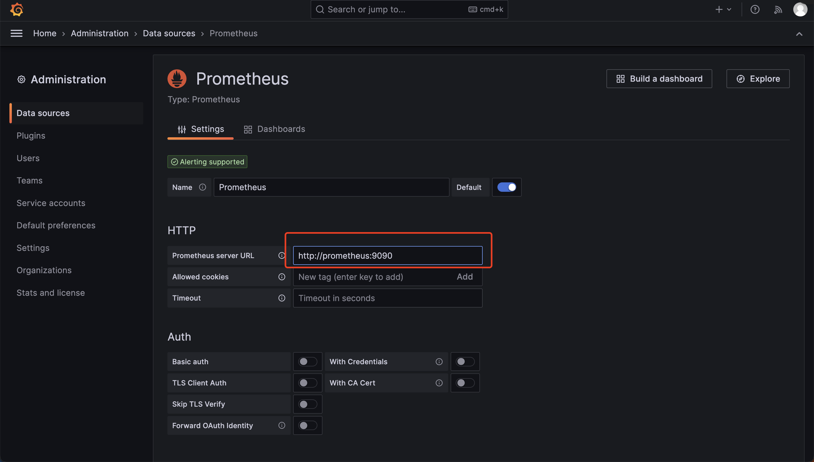


## 导入 Dashboard

为了能够快速对系统进行监控，我们可以直接复用别人的 Grafana Dashboard，在 Grafana 的官方网站上就有很多非常优秀的第三方 Dashboard，我们完全可以直接导入进来即可。比如我们想要对所有的集群节点进行监控，也就是 node-exporter 采集的数据进行展示，这里我们就可以导入 [https://grafana.com/grafana/dashboards/16098](https://grafana.com/grafana/dashboards/16098-1-node-exporter-for-prometheus-dashboard-cn-0417-job/) 这个 Dashboard。

在顶部菜单栏点击 `+`，选择 `Import dashboard`，在 Grafana Dashboard 的文本框中输入 `16098` 即可导入：

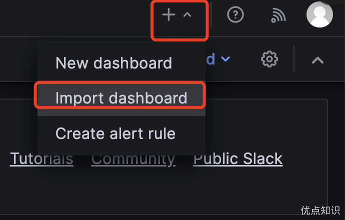

进入导入 Dashboard 的页面，可以编辑名称，选择 Prometheus 的数据源：

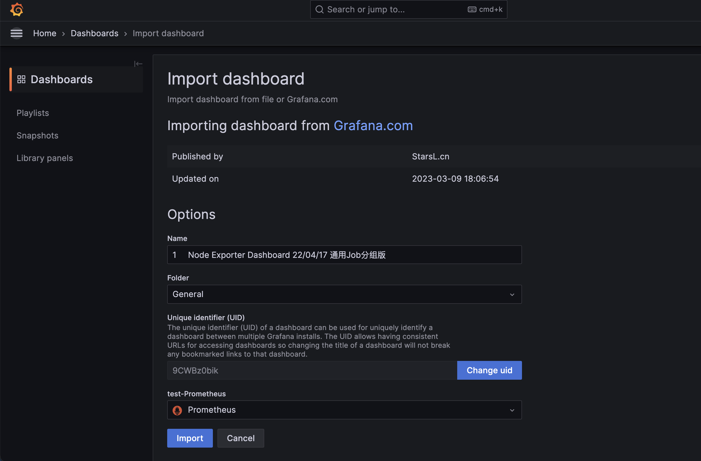

保存后即可进入导入的 Dashboard 页面。由于该 Dashboard 更新比较及时，所以基本上导入进来就可以直接使用了，我们也可以对页面进行一些调整，如果有的图表没有出现对应的图形，则可以编辑根据查询语句去 DEBUG。

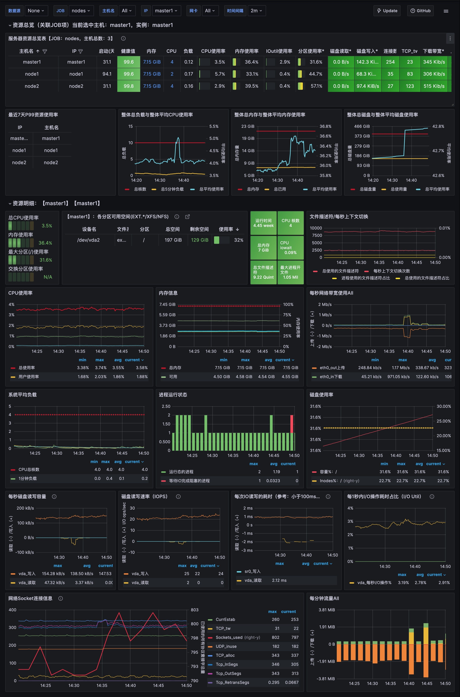


## 自定义图表

导入现成的第三方 Dashboard 或许能解决我们大部分问题，但是毕竟还会有需要定制图表的时候，这个时候就需要了解如何去自定义图表了。

同样在顶部菜单栏点击 `+`，选择 `New dashboard`：

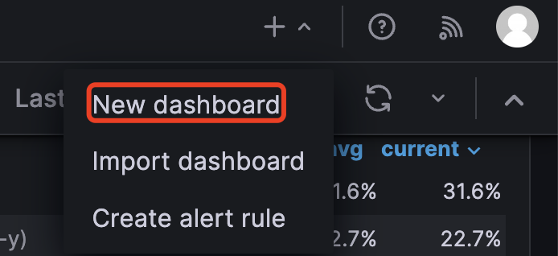

然后选择 `Add visualization` 创建一个图表：


然后在下方 Query 栏中选择 `Prometheus` 这个数据源：

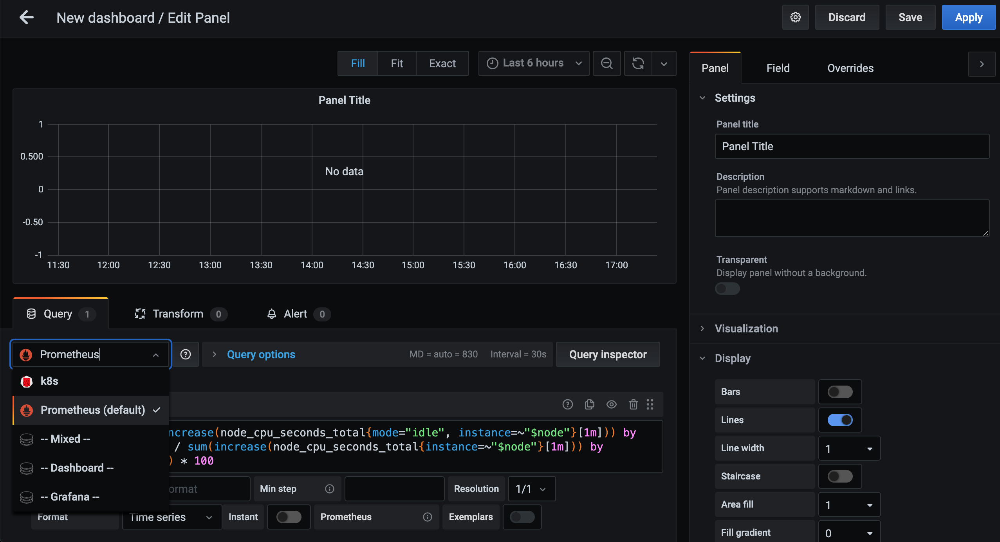

然后在 `Metrics` 区域输入我们要查询的监控 PromQL 语句，比如我们这里想要查询集群节点 CPU 的使用率：

```
(1 - sum(increase(node_cpu_seconds_total{mode="idle", instance=~"$node"}[1m])) by (instance) / sum(increase(node_cpu_seconds_total{instance=~"$node"}[1m])) by (instance)) * 100
```

虽然我们现在还没有具体的学习过 PromQL 语句，但其实我们仔细分析上面的语句也不是很困难，集群节点的 CPU 使用率实际上就相当于排除空闲 CPU 的使用率，所以我们可以优先计算空闲 CPU 的使用时长，除以总的 CPU 时长就是使用率了，用 1 减掉过后就是 CPU 的使用率了，如果想用百分比来表示的话则乘以 100 即可。

这里有一个需要注意的地方是在 PromQL 语句中有一个 `instance=~"$node"` 的标签，其实意思就是根据 `$node` 这个参数来进行过滤，也就是我们希望在 Grafana 里面通过参数化来控制每一次计算哪一个节点的 CPU 使用率。

所以这里就涉及到 Grafana 里面的参数使用。点击页面顶部的 `Dashboard Settings` 按钮进入配置页面：

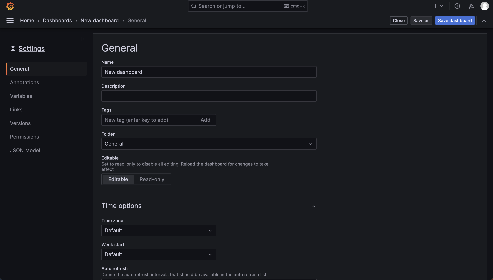

在左侧 tab 栏点击 `Variables` 进入参数配置页面，如果还没有任何参数，可以通过点击 `Add Variable` 添加一个新的变量：

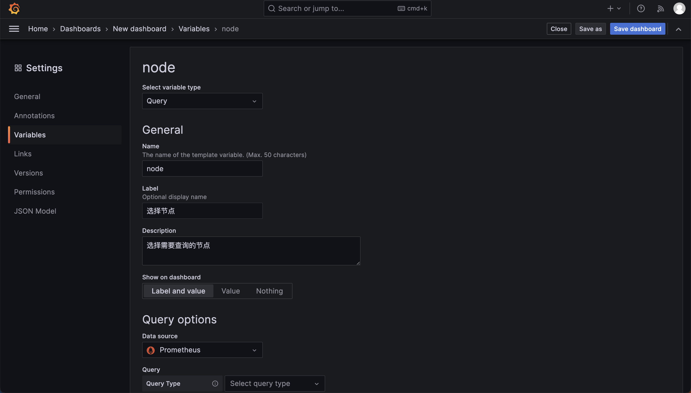

这里需要注意的是变量的名称 `node` 就是上面我们在 PromQL 语句里面使用的 `$node` 这个参数，这两个地方必须保持一致，然后最重要的就是参数的获取方式了，比如我们可以通过 `Prometheus` 这个数据源，通过 `kubelet_node_name` 这个指标来获取，在 Prometheus 里面我们可以查询该指标获取到的值为：

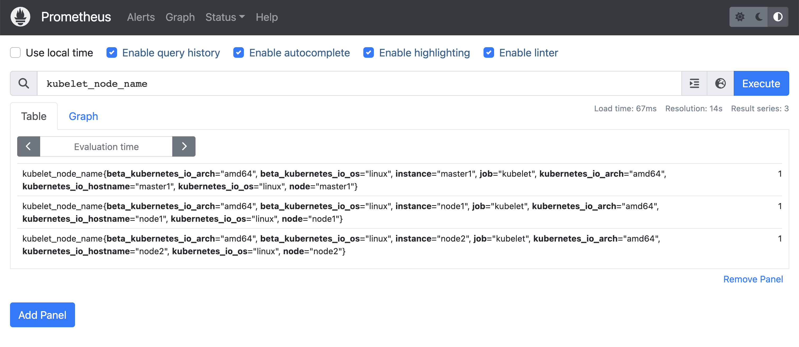

我们其实只是想要获取节点的名称，所以我们可以用正则表达式去匹配 `node=xxx` 这个标签，将匹配的值作为参数的值即可，更简单的方式是直接获取 `node` 标签的值（两种方式均可）:

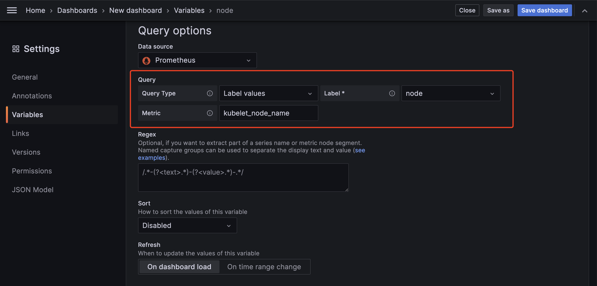

在最下面的 `Preview of values` 里面会有获取的参数值的预览结果。另外由于我们希望能够让用户自由选择一次性可以查询多少个节点的数据，所以我们将 `Multi-value` 以及 `Include All option` 都勾选上了，最后记得保存。

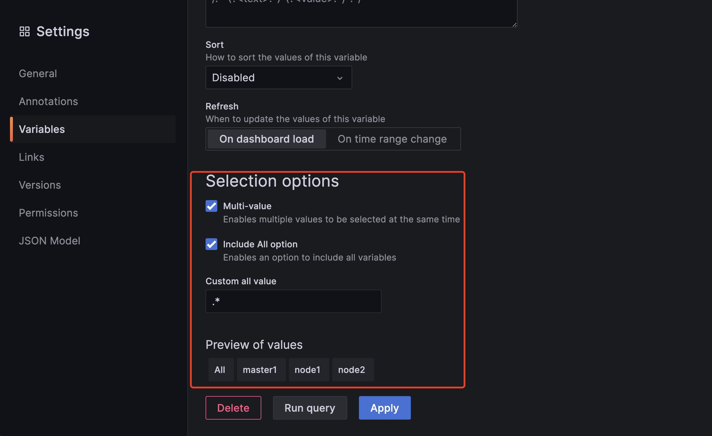

保存后跳转到 Dashboard 页面就可以看到我们自定义的图表信息：


> 原文: <https://www.yuque.com/cnych/k8s4/zaiefoiy0r4nb8tl>