# 39.Alertmanager

前面我们学习 Prometheus 的时候了解到 Prometheus 包含一个报警模块，就是我们的 `Alertmanager`，Alertmanager 主要用于接收 Prometheus 发送的告警信息，它支持丰富的告警通知渠道，而且很容易做到告警信息进行去重，降噪，分组等，是一款前卫的告警通知系统。

通过在 Prometheus 中定义告警规则，Prometheus 会周期性的对告警规则进行计算，如果满足告警触发条件就会向 Alertmanager 发送告警信息。


在 Prometheus 中一条告警规则主要由以下几部分组成：

- 告警名称：用户需要为告警规则命名，当然对于命名而言，需要能够直接表达出该告警的主要内容
- 告警规则：告警规则实际上主要由 `PromQL` 进行定义，其实际意义是当表达式（PromQL）查询结果持续多长时间（During）后触发告警

在 Prometheus 中，还可以通过 Group（告警组）对一组相关的告警进行统一定义。Alertmanager 作为一个独立的组件，负责接收并处理来自 Prometheus Server 的告警信息。Alertmanager 可以对这些告警信息进行进一步的处理，比如当接收到大量重复告警时能够消除重复的告警信息，同时对告警信息进行分组并且路由到正确的通知方，Alertmanager 内置了对邮件、Slack 多种通知方式的支持，同时还支持与 Webhook 的集成，以支持更多定制化的场景。例如，目前 Alertmanager 还不支持钉钉，用户完全可以通过 Webhook 与钉钉机器人进行集成，从而通过钉钉接收告警信息。同时 Alertmanager 还提供了静默和告警抑制机制来对告警通知行为进行优化。


## 安装

从官方文档 [https://prometheus.io/docs/alerting/configuration/](https://prometheus.io/docs/alerting/configuration/) 中我们可以看到下载 Alertmanager 二进制文件后，可以通过下面的命令运行：

```shell
➜ ./alertmanager --config.file=simple.yml
```

其中 `-config.file` 参数是用来指定对应的配置文件的，由于我们这里同样要运行到 Kubernetes 集群中来，所以我们使用 Docker 镜像的方式来安装，使用的镜像是：`prom/alertmanager:v0.25.0`。

首先，指定配置文件，同样的，我们这里使用一个 ConfigMap 资源对象：

```yaml
# alertmanager-config.yaml
apiVersion: v1
kind: ConfigMap
metadata:
  name: alert-config
  namespace: monitor
data:
  config.yml: |-
    global:
      # 当alertmanager持续多长时间未接收到告警后标记告警状态为 resolved
      resolve_timeout: 5m
      # 配置邮件发送信息
      smtp_smarthost: 'smtp.qq.com:465'
      smtp_from: '517554016@qq.com'
      smtp_auth_username: '517554016@qq.com'
      smtp_auth_password: '<QQ邮箱授权码>'
      smtp_hello: 'qq.com'
      smtp_require_tls: false
    # 所有报警信息进入后的根路由，用来设置报警的分发策略
    route:
      # 这里的标签列表是接收到报警信息后的重新分组标签，例如，接收到的报警信息里面有许多具有 cluster=A 和 alertname=LatncyHigh 这样的标签的报警信息将会批量被聚合到一个分组里面
      group_by: ['alertname', 'cluster']
      # 当一个新的报警分组被创建后，需要等待至少 group_wait 时间来初始化通知，这种方式可以确保您能有足够的时间为同一分组来获取多个警报，然后一起触发这个报警信息。
      group_wait: 30s

      # 相同的group之间发送告警通知的时间间隔
      group_interval: 30s

      # 如果一个报警信息已经发送成功了，等待 repeat_interval 时间来重新发送他们，不同类型告警发送频率需要具体配置
      repeat_interval: 1h

      # 默认的receiver：如果一个报警没有被一个route匹配，则发送给默认的接收器
      receiver: default

      # 上面所有的属性都由所有子路由继承，并且可以在每个子路由上进行覆盖。
      routes:
      - receiver: email
        group_wait: 10s
        group_by: ['instance'] # 根据instance做分组
        match:
          team: node
    receivers:
    - name: 'default'
      email_configs:
      - to: 'ych_1024@163.com'
        send_resolved: true  # 接受告警恢复的通知
    - name: 'email'
      email_configs:
      - to: 'ych_1024@163.com'
        send_resolved: true
```

> 分组机制可以将详细的告警信息合并成一个通知，在某些情况下，比如由于系统宕机导致大量的告警被同时触发，在这种情况下分组机制可以将这些被触发的告警合并为一个告警通知，避免一次性接受大量的告警通知，而无法对问题进行快速定位。


这是 Alertmanager 的配置文件，我们先直接创建这个 ConfigMap 资源对象：

```shell
➜ kubectl apply -f alertmanager-config.yaml
```

然后配置 Alertmanager 的容器，直接使用一个 Deployment 来进行管理即可，对应的 YAML 资源声明如下：

```yaml
apiVersion: apps/v1
kind: Deployment
metadata:
  name: alertmanager
  namespace: monitor
  labels:
    app: alertmanager
spec:
  selector:
    matchLabels:
      app: alertmanager
  template:
    metadata:
      labels:
        app: alertmanager
    spec:
      volumes:
        - name: alertcfg
          configMap:
            name: alert-config
      containers:
        - name: alertmanager
          image: prom/alertmanager:v0.25.0
          imagePullPolicy: IfNotPresent
          args:
            - "--config.file=/etc/alertmanager/config.yml"
          ports:
            - containerPort: 9093
              name: http
          volumeMounts:
            - mountPath: "/etc/alertmanager"
              name: alertcfg
          resources:
            requests:
              cpu: 100m
              memory: 256Mi
            limits:
              cpu: 100m
              memory: 256Mi
```

这里我们将上面创建的 `alert-config` 这个 ConfigMap 资源对象以 Volume 的形式挂载到 `/etc/alertmanager` 目录下去，然后在启动参数中指定了配置文件 `--config.file=/etc/alertmanager/config.yml`，然后我们可以来创建这个资源对象：

```shell
➜ kubectl apply -f alertmanager-deploy.yaml
```

为了可以访问到 Alertmanager，同样需要我们创建一个对应的 Service 对象：

```yaml
# alertmanager-svc.yaml
apiVersion: v1
kind: Service
metadata:
  name: alertmanager
  namespace: monitor
  labels:
    app: alertmanager
spec:
  selector:
    app: alertmanager
  type: NodePort
  ports:
    - name: web
      port: 9093
      targetPort: http
```

使用 NodePort 类型也是为了方便测试，创建上面的 Service 这个资源对象：

```shell
➜ kubectl apply -f alertmanager-svc.yaml
➜ kubectl get pods -n monitor -l app=alertmanager
NAME                            READY   STATUS    RESTARTS   AGE
alertmanager-67848c965d-ztnzj   1/1     Running   0          3m22s
➜ kubectl get svc -n monitor -l app=alertmanager
NAME           TYPE       CLUSTER-IP     EXTERNAL-IP   PORT(S)          AGE
alertmanager   NodePort   10.101.38.65   <none>        9093:31727/TCP   3m16s
```

Alertmanager 的容器启动起来后，我们就可以通过 NodePort 端口去访问到 Alertmanager 的 Web 界面了，访问地址为：`http://<NodeIP>:<NodePort>`，这里我们可以看到 Alertmanager 的 Web 界面：

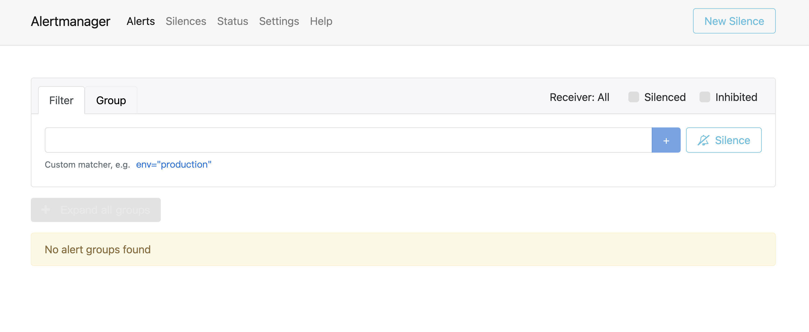

我们还需要在 Prometheus 中配置下 Alertmanager 的地址，让 Prometheus 能够访问到 Alertmanager，在 Prometheus 的 ConfigMap 资源清单中添加如下配置：

```yaml
alerting:
  alertmanagers:
    - static_configs:
        - targets: ["alertmanager:9093"]
```

更新这个资源对象后，稍等一小会儿，执行 reload 操作即可。


## 报警规则

现在我们只是把 Alertmanager 容器运行起来了，和 Prometheus 进行了关联，但是我们并不知道要做什么报警，因为没有任何地方告诉我们要报警，所以我们还需要配置一些报警规则来告诉我们对哪些数据进行报警。

警报规则允许你基于 Prometheus 表达式语言的表达式来定义报警报条件，并在触发警报时发送通知给外部的接收者。

同样在 Prometheus 的配置文件中添加如下报警规则配置：

```yaml
rule_files:
  - /etc/prometheus/rules.yml
```

其中 `rule_files` 就是用来指定报警规则的，这里我们同样将 `rules.yml` 文件用 ConfigMap 的形式挂载到 `/etc/prometheus` 目录下面即可，比如下面的规则：

```yaml
apiVersion: v1
kind: ConfigMap
metadata:
  name: prometheus-config
  namespace: monitor
data:
  prometheus.yml: |
    global:
      scrape_interval: 15s
      scrape_timeout: 15s
      evaluation_interval: 30s  # 默认情况下每分钟对告警规则进行计算
    alerting:
      alertmanagers:
      - static_configs:
        - targets: ["alertmanager:9093"]
    rule_files:
    - /etc/prometheus/rules.yml
  ...... # 省略prometheus其他部分
  rules.yml: |
    groups:
    - name: test-node-mem
      rules:
      - alert: NodeMemoryUsage
        expr: (node_memory_MemTotal_bytes - (node_memory_MemFree_bytes + node_memory_Buffers_bytes + node_memory_Cached_bytes)) / node_memory_MemTotal_bytes * 100 > 20
        for: 2m
        labels:
          team: node
        annotations:
          summary: "{{$labels.instance}}: High Memory usage detected"
          description: "{{$labels.instance}}: Memory usage is above 20% (current value is: {{ $value }}"
```

上面我们定义了一个名为 `NodeMemoryUsage` 的报警规则，一条报警规则主要由以下几部分组成：

- `alert`：告警规则的名称
- `expr`：是用于进行报警规则 PromQL 查询语句
- `for`：评估等待时间（Pending Duration），用于表示只有当触发条件持续一段时间后才发送告警，在等待期间新产生的告警状态为 `pending`
- `labels`：自定义标签，允许用户指定额外的标签列表，把它们附加在告警上
- `annotations`：指定了另一组标签，它们不被当做告警实例的身份标识，它们经常用于存储一些额外的信息，用于报警信息的展示之类的

> 这个参数主要用于降噪，很多类似响应时间这样的指标都是有抖动的，通过指定 `Pending Duration`，我们可以过滤掉这些瞬时抖动，可以让我们能够把注意力放在真正有持续影响的问题上。


为了让告警信息具有更好的可读性，Prometheus 支持模板化 `label` 和 `annotations` 中的标签的值，通过 `$labels.变量` 可以访问当前告警实例中指定标签的值，`$value` 则可以获取当前 PromQL 表达式计算的样本值。

为了方便演示，我们将的表达式判断报警临界值设置为 20，重新更新 ConfigMap 资源对象，由于我们在 Prometheus 的 Pod 中已经通过 Volume 的形式将 prometheus-config 这个一个 ConfigMap 对象挂载到了 `/etc/prometheus` 目录下面，所以更新后，该目录下面也会出现 `rules.yml` 文件，所以前面配置的 `rule_files` 路径也是正常的，更新完成后，重新执行 reload 操作，这个时候我们去 Prometheus 的 Dashboard 中切换到 alerts 路径下面就可以看到有报警配置规则的数据了：


页面中出现了我们刚刚定义的报警规则信息，而且报警信息中还有状态显示，一个报警信息在生命周期内有下面 3 种状态：

- `pending`: 表示在设置的阈值时间范围内被激活了
- `firing`: 表示超过设置的阈值时间被激活了
- `inactive`: 表示当前报警信息处于非活动状态

同时对于已经 `pending` 或者 `firing` 的告警，Prometheus 也会将它们存储到时间序列 `ALERTS{}`中。当然我们也可以通过表达式去查询告警实例：

```
ALERTS{alertname="<alert name>", alertstate="pending|firing", <additional alert labels>}
```

样本值为 `1` 表示当前告警处于活动状态（pending 或者 firing），当告警从活动状态转换为非活动状态时，样本值则为 0。

当这里的状态变成 `firing` 就表示这个报警已经被激活了，此时在 Alertmanager 的页面上就可以看到对应的报警信息了：

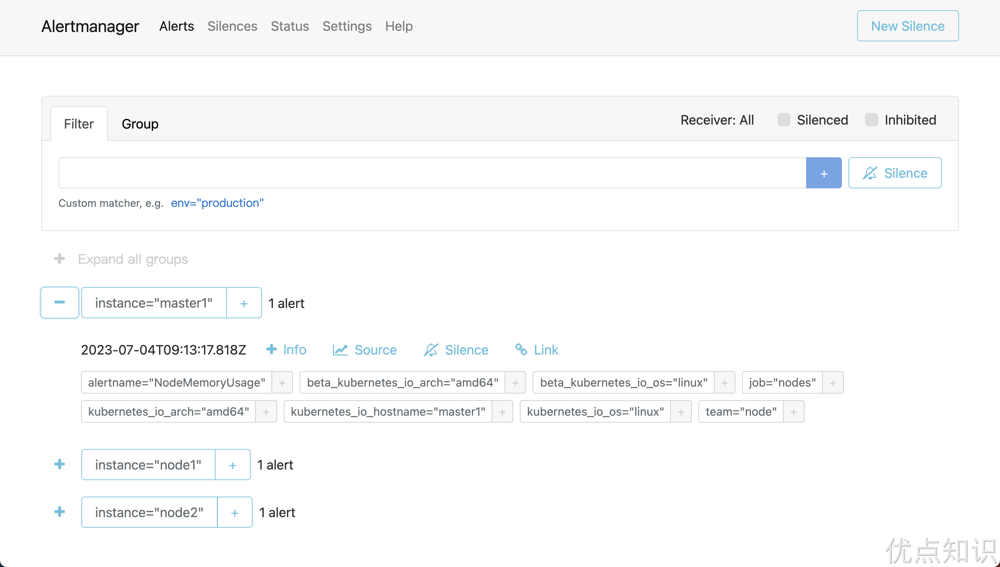

我们这里的报警信息有一个 `team=node` 这样的标签，而最上面我们配置 alertmanager 的时候就有如下的路由配置信息了：

```yaml
routes:
  - receiver: email
    group_wait: 10s
    group_by: ["instance"] # 根据instance做分组
    match:
      team: node
```

所以我们这里的报警信息会被 email 这个接收器来进行报警，我们上面配置的是邮箱，所以正常来说这个时候我们会收到该报警，由于我们还做了根据 `instance` 标签进行分组，所以正常不同的 instance 会发送不同的报警信息：


详细的报警邮件如下所示：

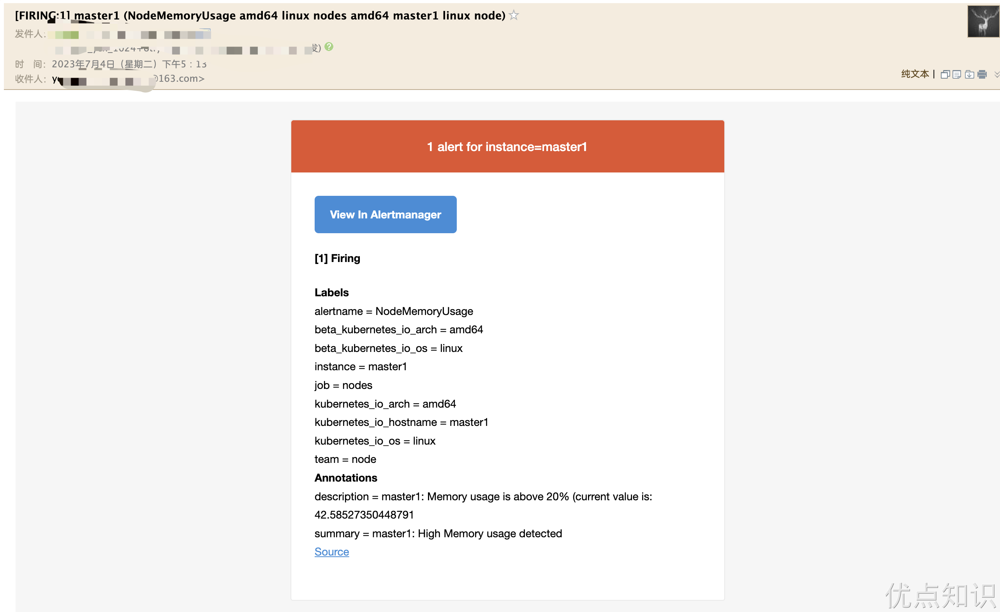

在 Alertmanager 页面中我们还可以进行一些操作，比如过滤、分组等等，里面还有两个新的概念：`Inhibition(抑制)` 和 `Silences(静默)`。

- Inhibition：如果某些其他警报已经触发了，则对于某些警报，Inhibition 是一个抑制通知的概念。例如：一个警报已经触发，它正在通知整个集群是不可达的时，Alertmanager 则可以配置成关心这个集群的其他警报无效。这可以防止与实际问题无关的数百或数千个触发警报的通知，Inhibition 需要通过上面的配置文件进行配置。
- Silences：静默是一个非常简单的方法，可以在给定时间内简单地忽略所有警报。Silences 基于 matchers 配置，类似路由树。来到的警告将会被检查，判断它们是否和活跃的 Silences 相等或者正则表达式匹配。如果匹配成功，则不会将这些警报发送给接收者。

由于全局配置中我们配置的 `repeat_interval: 1h`，所以正常来说，上面的测试报警如果一直满足报警条件(内存使用率大于 20%)的话，那么每 1 小时我们就可以收到一条报警邮件。

一条告警产生后，还要经过 Alertmanager 的分组、抑制处理、静默处理、去重处理和降噪处理最后再发送给接收者。这个过程中可能会因为各种原因会导致告警产生了却最终没有进行通知，可以通过下图了解整个告警的生命周期：

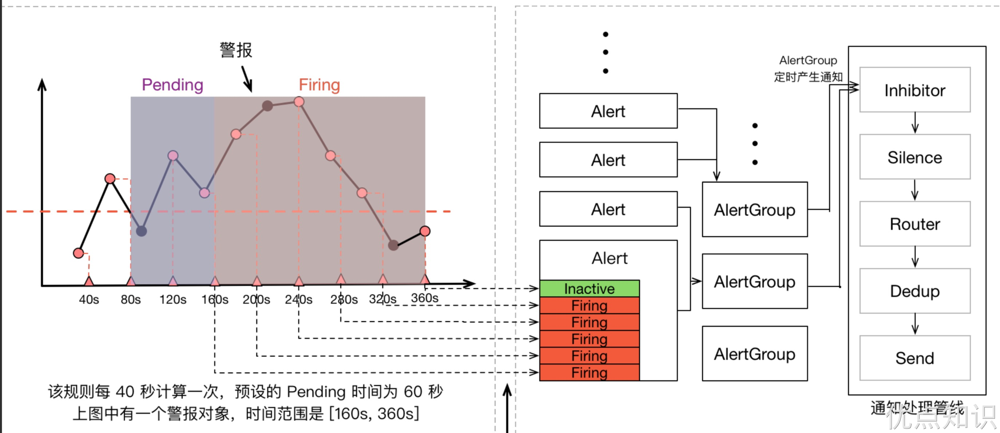


## 报警过滤

有的时候可能报警通知太过频繁，或者在收到报警通知后就去开始处理问题了，这个期间可能报警还在频繁发送，这个时候我们可以去对报警进行静默设置。


### 静默通知

在 Alertmanager 的后台页面中提供了静默操作的入口。

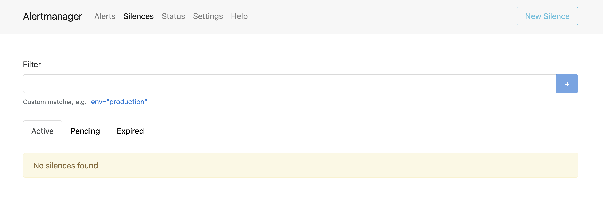

可以点击右上面的 `New Silence` 按钮新建一个静默通知：

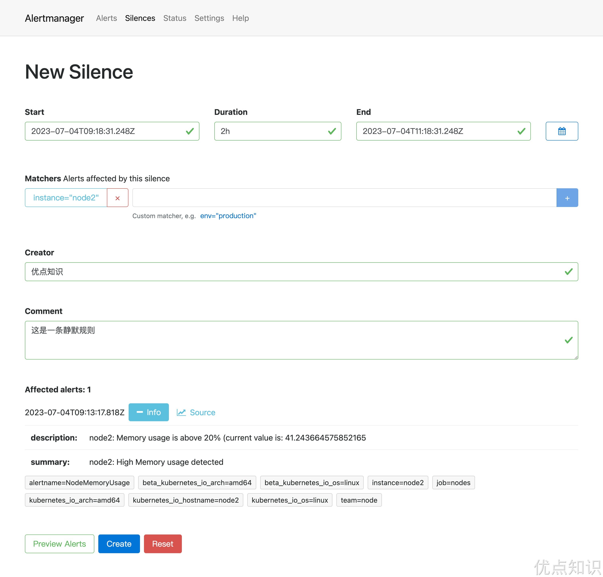

我们可以选择此次静默的开始时间、结束时间，最重要的是下面的 `Matchers` 部分，用来匹配哪些报警适用于当前的静默，比如这里我们设置 `instance=node2` 的标签，则表示具有这个标签的报警在 2 小时内都不会触发报警，点击下面的 `Create` 按钮即可创建：

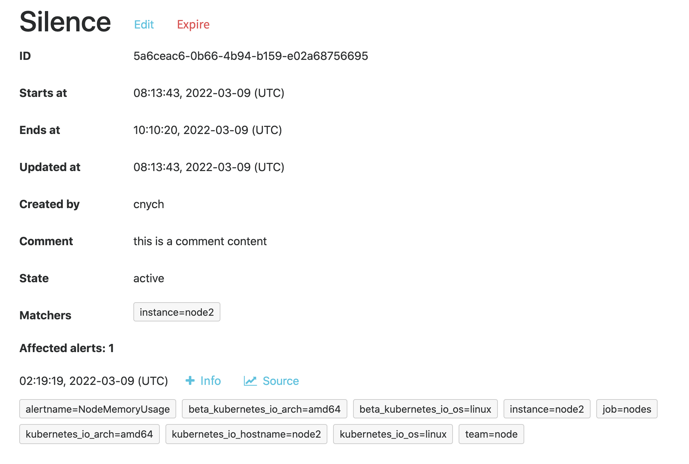

创建完成后还可以对该配置进行编辑或者让其过期等操作。此时在静默列表也可以看到创建的静默状态。


### 抑制

除了上面的静默机制之外，Alertmanager 还提供了抑制机制来控制告警通知的行为。抑制是指当某次告警发出后，可以停止重复发送由此告警引发的其他告警的机制，比如现在有一台服务器宕机了，上面跑了很多服务都设置了告警，那么肯定会收到大量无用的告警信息，这个时候抑制就非常有用了，可以有效的防止告警风暴。

要使用抑制规则，需要在 Alertmanager 配置文件中的 `inhibit_rules` 属性下面进行定义，每一条抑制规则的具体配置如下：

```yaml
target_match:
  [ <labelname>: <labelvalue>, ... ]
target_match_re:
  [ <labelname>: <regex>, ... ]

source_match:
  [ <labelname>: <labelvalue>, ... ]
source_match_re:
  [ <labelname>: <regex>, ... ]

equal: '[' <labelname>, ... ']'
```

当已经发送的告警通知匹配到 `target_match` 和 `target_match_re` 规则，当有新的告警规则如果满足 `source_match` 或者 `source_match_re` 的匹配规则，并且已发送的告警与新产生的告警中 `equal` 定义的标签完全相同，则启动抑制机制，新的告警不会发送。

例如当集群中的某一个主机节点异常宕机导致告警 NodeDown 被触发，同时在告警规则中定义了告警级别 为 `severity=critical`，由于主机异常宕机，则该主机上部署的所有服务会不可用并触发报警，根据抑制规则的定义，如果有新的告警级别为 `severity=critical`，并且告警中标签 `instance` 的值与 NodeDown 告警的相同，则说明新的告警是由 NodeDown 导致的，则启动抑制机制停止向接收器发送通知。

```yaml
- source_match:
    alertname: NodeDown
    severity: critical
  target_match:
    severity: critical
  equal:
    - instance
```

比如现在我们如下所示的两个报警规则 `NodeMemoryUsage` 与 `NodeLoad`：

```yaml
groups:
  - name: test-node-mem
    rules:
      - alert: NodeMemoryUsage
        expr: (node_memory_MemTotal_bytes - (node_memory_MemFree_bytes + node_memory_Buffers_bytes + node_memory_Cached_bytes)) / node_memory_MemTotal_bytes * 100 > 30
        for: 2m
        labels:
          team: node
          severity: critical
        annotations:
          summary: "{{$labels.instance}}: High Memory usage detected"
          description: "{{$labels.instance}}: Memory usage is above 30% (current value is: {{ $value }})"
  - name: test-node-load
    rules:
      - alert: NodeLoad
        expr: node_load5 < 1
        for: 2m
        labels:
          team: node
          severity: normal
        annotations:
          summary: "{{ $labels.instance }}: Low node load deteched"
          description: "{{ $labels.instance }}: node load is below 1 (current value is: {{ $value }})"
```

当前我们系统里面普通（`severity: normal`）的告警有三条，node1、node2 和 master1 三个节点，另外一个报警有两条，master1 和 node2 两个节点：

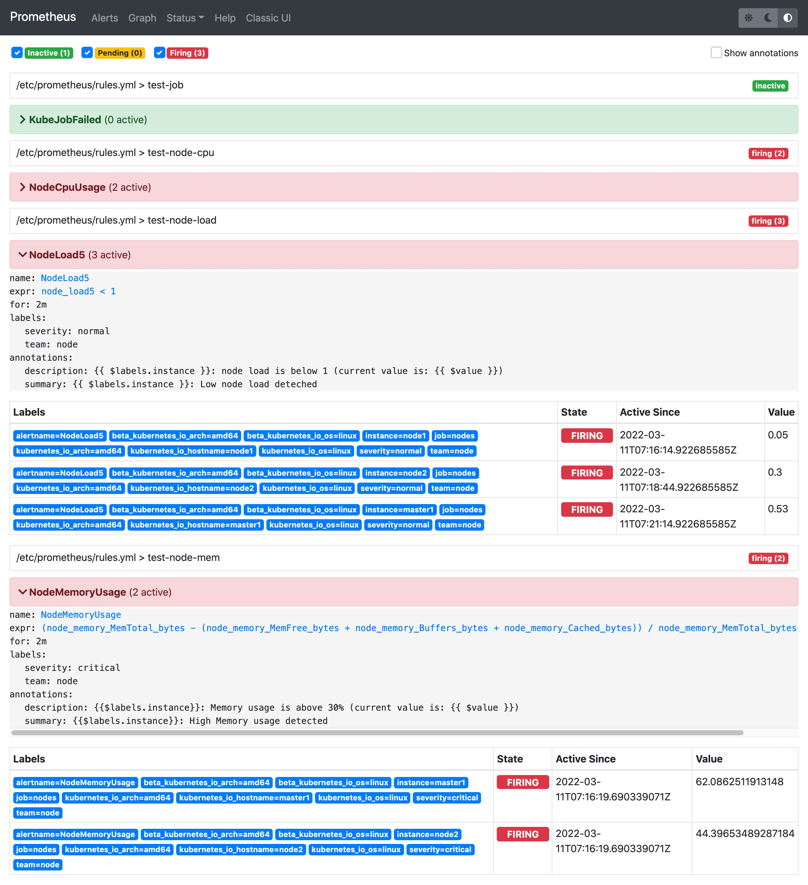

现在我们假设来配置一个抑制规则，如果 `NodeMemoryUsage` 报警触发，则抑制 `NodeLoad` 指标规则引起的报警，我们这里就会抑制 master1 和 node2 节点的告警，只会剩下 node1 节点的普通告警。

在 Alertmanager 配置文件中添加如下所示的抑制规则：

```yaml
inhibit_rules:
  - source_match:
      alertname: NodeMemoryUsage
      severity: critical
    target_match:
      severity: normal
    equal:
      - instance
```

更新配置后，最好重建下 Alertmanager，这样可以再次触发下报警，可以看到只能收到 node1 节点的 NodeLoad 报警了，另外两个节点的报警被抑制了：

这就是 Alertmanager 抑制的使用方式。


## 报警接收器

Alertmanager 支持很多内置的报警接收器，如 email、slack、企业微信、webhook 等，上面的测试我们使用的 email 来接收报警。


### 通知模板

告警通知使用的是默认模版，因为它已经编译到二进制包了，所以我们不需要额外配置。如果我们想自定义模版，这又该如何配置呢？

Alertmanager 默认使用的通知模板可以从 [https://github.com/prometheus/alertmanager/blob/master/template/default.tmpl](https://github.com/prometheus/alertmanager/blob/master/template/default.tmpl) 获取，Alertmanager 的通知模板是基于 [Golang 的模板系统](http://golang.org/pkg/text/template)，当然也支持用户自定义和使用自己的模板。

第一种方式是基于模板字符串，直接在 Alertmanager 的配置文件中使用模板字符串，如下所示：

```yaml
receivers:
  - name: "slack-notifications"
    slack_configs:
      - channel: "#alerts"
        text: "https://internal.myorg.net/wiki/alerts/{{ .GroupLabels.app }}/{{ .GroupLabels.alertname }}"
```

直接在配置文件中可以使用一些模板字符串，比如获取 `{{ .GroupLabels }}` 下面的一些属性。

另外一种方法就是直接修改官方默认的模板，此外也可以自定义可复用的模板文件，比如针对 email 的模板，我们可以创建一个名为 `template_email.tmpl` 的自定义模板文件，如下所示：

```yaml
apiVersion: v1
kind: ConfigMap
metadata:
  name: alert-config
  namespace: monitor
data:
  config.yml: |-
    global:  # 全局配置
      ......
    route:  # 路由
      ......
    templates:  # 增加 templates 配置，指定模板文件
    - '/etc/alertmanager/template_email.tmpl'

    receivers:  # 接收器
    - name: 'email'
      email_configs:
      - to: '517554016@qq.com'
        send_resolved: true
        html: '{{ template "email.html" . }}' # 此处通过 html 指定模板文件中定义的 email.html 模板

  # 下面定义 email.html 必须和上面指定的一致，注释不能写进模板文件中
  template_email.tmpl: |-
    {{ define "email.html" }}
    {{- if gt (len .Alerts.Firing) 0 -}}{{ range .Alerts }}
    @报警<br>
    <strong>实例:</strong> {{ .Labels.instance }}<br>
    <strong>概述:</strong> {{ .Annotations.summary }}<br>
    <strong>详情:</strong> {{ .Annotations.description }}<br>
    <strong>时间:</strong> {{ (.StartsAt.Add 28800e9).Format "2006-01-02 15:04:05" }}<br>
    {{ end }}{{ end -}}<br>
    {{- if gt (len .Alerts.Resolved) 0 -}}{{ range .Alerts }}<br>
    @恢复<br>
    <strong>实例:</strong> {{ .Labels.instance }}<br>
    <strong>信息:</strong> {{ .Annotations.summary }}<br>
    <strong>恢复:</strong> {{ (.StartsAt.Add 28800e9).Format "2006-01-02 15:04:05" }}<br>
    {{ end }}{{ end -}}
    {{- end }}
```

在 Alertmanager 配置中通过 `templates` 属性来指定我们自定义的模板路径，这里我们定义的 `template_email.tmpl` 模板会通过 Configmap 挂载到 `/etc/alertmanager` 路径下，模板中通过 `{{ define "email.html" }}` 定义了一个名为 `email.html` 的命名模板，然后在 email 的接收器中通过 `email_configs.html` 来指定定义的命名模板即可。更新上面 Alertmanager 的配置对象，重启 Alertmanager 服务，然后等待告警发出，即可看到我们如下所示自定义的模板信息：

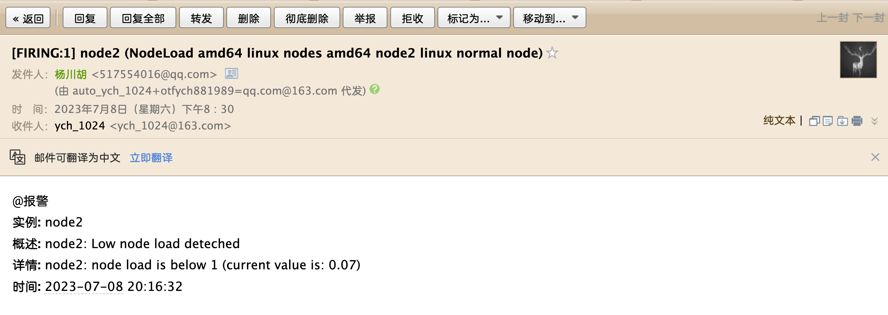


### WebHook 接收器

上面我们配置的是 AlertManager 自带的邮件报警模板，我们也说了 AlertManager 支持很多中报警接收器，比如 slack、微信之类的，其中最为灵活的方式当然是使用 webhook 了，我们可以定义一个 webhook 来接收报警信息，然后在 webhook 里面去进行处理，需要发送怎样的报警信息我们自定义就可以，下面的 JSON 数据就是 AlertManager 将报警信息 POST 给 webhook 的数据：

```json
{
  "receiver": "webhook",
  "status": "firing",
  "alerts": [
    {
      "status": "firing",
      "labels": {
        "alertname": "NodeMemoryUsage",
        "beta_kubernetes_io_arch": "amd64",
        "beta_kubernetes_io_os": "linux",
        "instance": "node1",
        "job": "nodes",
        "kubernetes_io_arch": "amd64",
        "kubernetes_io_hostname": "node1",
        "kubernetes_io_os": "linux",
        "team": "node"
      },
      "annotations": {
        "description": "node1: Memory usage is above 30% (current value is: 42.097619438581596)",
        "summary": "node1: High Memory usage detected"
      },
      "startsAt": "2023-07-04T12:49:17.818Z",
      "endsAt": "0001-01-01T00:00:00Z",
      "generatorURL": "http://prometheus-649968556c-8p4tj:9090/graph?g0.expr=%28node_memory_MemTotal_bytes+-+%28node_memory_MemFree_bytes+%2B+node_memory_Buffers_bytes+%2B+node_memory_Cached_bytes%29%29+%2F+node_memory_MemTotal_bytes+%2A+100+%3E+30\u0026g0.tab=1",
      "fingerprint": "8cc4749f998d64dd"
    }
  ],
  "groupLabels": { "instance": "node1" },
  "commonLabels": {
    "alertname": "NodeMemoryUsage",
    "beta_kubernetes_io_arch": "amd64",
    "beta_kubernetes_io_os": "linux",
    "instance": "node1",
    "job": "nodes",
    "kubernetes_io_arch": "amd64",
    "kubernetes_io_hostname": "node1",
    "kubernetes_io_os": "linux",
    "team": "node"
  },
  "commonAnnotations": {
    "description": "node1: Memory usage is above 30% (current value is: 42.097619438581596)",
    "summary": "node1: High Memory usage detected"
  },
  "externalURL": "http://alertmanager-5774d6f5f4-prdgr:9093",
  "version": "4",
  "groupKey": "{}/{team=\"node\"}:{instance=\"node1\"}",
  "truncatedAlerts": 0
}
```

要实现这个 webhook 也非常简单，只需要一个 HTTP 服务处理 POST 请求，然后将数据转发给钉钉机器人即可，这里我们可以借助 ChatGPT 来帮我们实现。


通过 ChatGPT 我们可以很快的就实现该需求，然后再做一些微调就可以了，最终的代码如下所示：

```python
import requests
import json
import time

from fastapi import FastAPI, HTTPException, Request
from dingtalkchatbot.chatbot import DingtalkChatbot

app = FastAPI()

# 钉钉机器人的 webhook 地址
dingtalk_webhook = "https://oapi.dingtalk.com/robot/send?access_token=xxxx"

secret = "xxxx"

# 钉钉机器人对象
dingtalk_robot = DingtalkChatbot(dingtalk_webhook, secret=secret)


@app.get("/")
def index():
    return "Hello Alertmanager!"


@app.post("/alert")
async def alert(alerts: dict):
    # 打印获取到的报警信息
    # print(alerts)
    try:
        # 构建钉钉消息内容
        message = "#### Alerts\n\n"
        for alert in alerts['alerts']:
            status = alert['status']
            labels = alert['labels']
            annotations = alert['annotations']

            message += f"**[{status.upper()}]**\n\n"
            for label, value in labels.items():
                message += f"**{label}:** {value}\n"
            message += "\n"
            for annotation, value in annotations.items():
                message += f"**{annotation}:** {value}\n"

            message += "\n---\n\n"  # 分隔不同的报警信息

        # 发送钉钉消息
        dingtalk_robot.send_markdown(title="有新的报警啦", text=message)

        return {"message": "Alerts processed successfully."}
    except Exception as e:
        print(e)
        raise HTTPException(status_code=500, detail=str(e))
```

该服务的代码非常简单，主要就是将报警信息转换成钉钉机器人支持的 markdown 格式，然后发送给钉钉机器人即可。当然代码中还涉及到机器人的一些配置，包括 webhook 地址和 secret 密钥，这些信息我们需要在钉钉中进行配置。

首先在钉钉群中选择创建一个自定义的机器人：

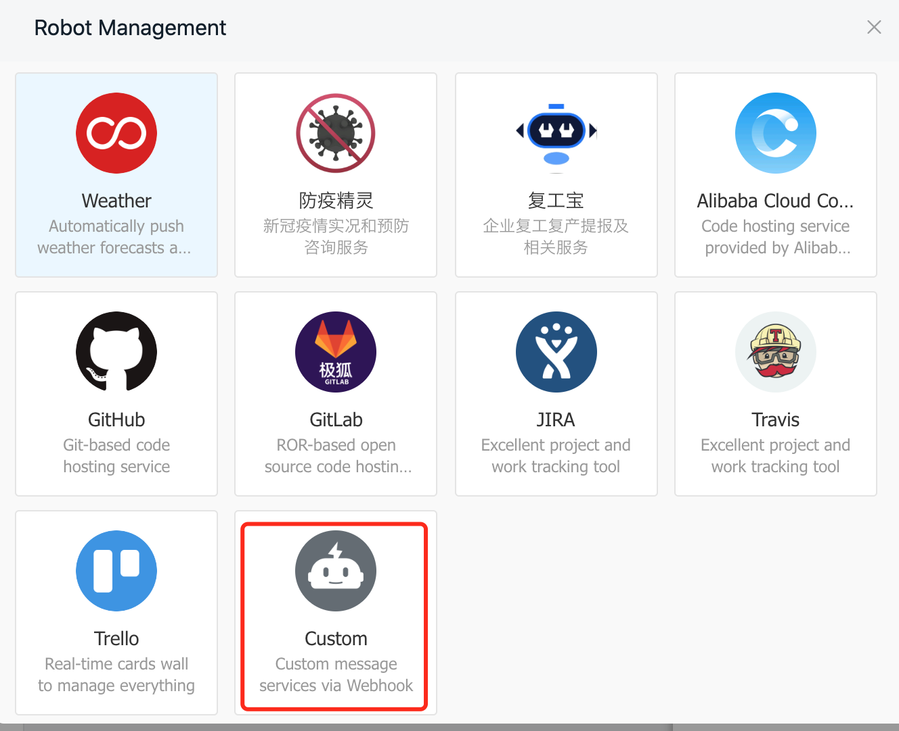

这里我们选择添加额外密钥的方式来验证机器人，其他两种方式可以忽略，需要记住该值，下面会使用：

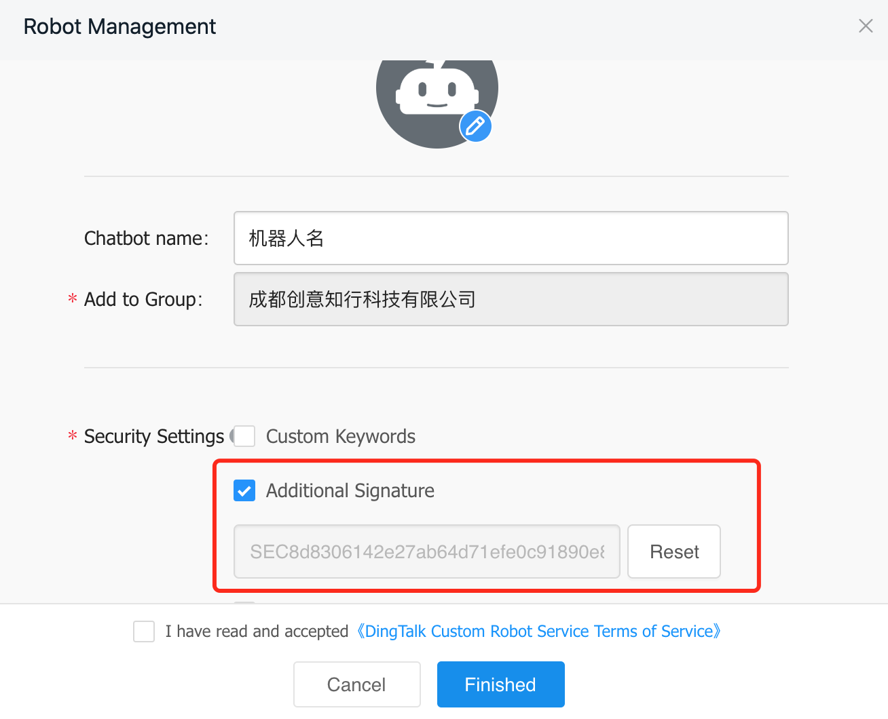

创建完成后会提供一个 webhook 的地址，该地址会带一个 acess_token 的参数，该参数下面也会使用：

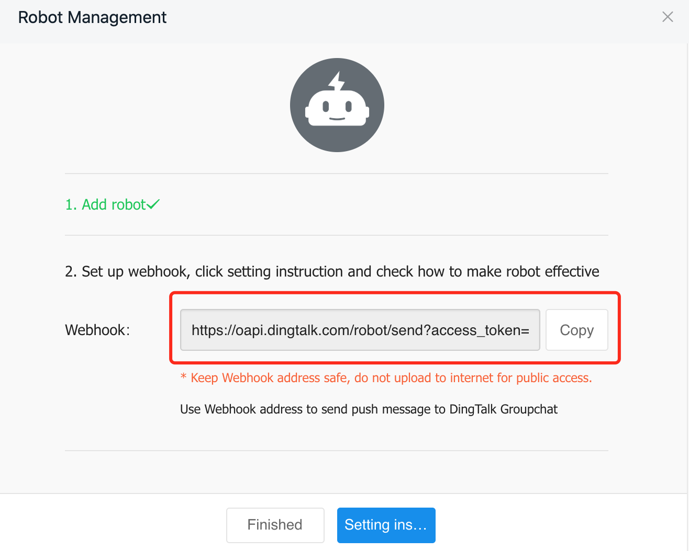

最好的方式当时是通过环境变量的方式注入到代码中去，这样可以避免密钥泄露，这里我们只是为了演示，所以直接写在代码中了。

然后在项目目录下面创建一个 `requirements.txt` 的文件，用于存放项目依赖的包：

```
uvicorn==0.20.0
requests==2.28.1
DingtalkChatbot==1.5.7
fastapi==0.95.0
```

为了将项目部署到 Kubernetes 集群中，我们需要将项目打包成一个镜像，这里我们使用 Dockerfile 来构建镜像：

```dockerfile
FROM python:3.8-slim-buster

# 设置工作目录
WORKDIR /app

# 安装依赖
COPY requirements.txt .
RUN pip install --no-cache-dir -r requirements.txt

# 复制应用程序代码
COPY main.py .

# 开放端口
EXPOSE 8000

# 使用 Uvicorn 启动应用程序
CMD ["uvicorn", "main:app", "--host", "0.0.0.0", "--port", "8000"]
```

当然这些实际上也是可以让 ChatGPT 来帮助我们生成的，然后根据该 Dockerfile 构建一个镜像，然后推送到镜像仓库中去，我这里最终生成的镜像地址为 `cnych/prom-dingtalk-webhook:v0.0.4`。

接下来我们需要将 webhook 服务部署到集群中，对应的资源清单如下：

```yaml
# alertmanager-webhook.yaml
apiVersion: apps/v1
kind: Deployment
metadata:
  name: dingtalk-webhook
  namespace: monitor
  labels:
    app: dingtalk-webhook
spec:
  selector:
    matchLabels:
      app: dingtalk-webhook
  template:
    metadata:
      labels:
        app: dingtalk-webhook
    spec:
      containers:
        - name: webhook
          image: cnych/prom-dingtalk-webhook:v0.0.4
          imagePullPolicy: IfNotPresent
          ports:
            - containerPort: 8000
          resources:
            limits:
              cpu: 100m
              memory: 100Mi
            requests:
              cpu: 100m
              memory: 100Mi

---
apiVersion: v1
kind: Service
metadata:
  name: dingtalk-webhook
  namespace: monitor
  labels:
    app: dingtalk-webhook
spec:
  selector:
    app: dingtalk-webhook
  ports:
    - port: 8000
```

配置完成后，直接创建上面的资源对象即可：

```shell
☸ ➜ kubectl apply -f alertmanager-webhook.yaml
☸ ➜ kubectl get pods -n monitor -l app=dingtalk-webhook
NAME                                READY   STATUS    RESTARTS   AGE
dingtalk-webhook-789989c4cb-scvvl   1/1     Running   0          69m
☸ ➜ kubectl get svc -n monitor -l app=dingtalk-webhook
NAME               TYPE        CLUSTER-IP       EXTERNAL-IP   PORT(S)    AGE
dingtalk-webhook   ClusterIP   10.103.139.188   <none>        8000/TCP   100m
```

部署成功后，现在我们就可以给 AlertManager 配置一个 webhook 了，在上面的配置中增加一个路由接收器

```yaml
  routes:
  - receiver: webhook
    group_wait: 10s
    group_by: ['instance']
    match:
      team: node
receivers:
- name: 'webhook'
  webhook_configs:
  - url: 'http://dingtalk-webhook:8000/alert'
    send_resolved: true
```

我们这里配置了一个名为 webhook 的接收器，地址为：`http://dingtalk-webhook:8000/alert`，这个地址当然就是上面我们部署的钉钉的 webhook 的接收程序的 Service 地址。

然后我们可以更新 AlertManager 和 Prometheus 的 ConfigMap 资源对象，更新完成后，隔一会儿执行 reload 操作是更新生效，如果有报警触发的话，隔一会儿关于这个节点文件系统的报警就会被触发了，由于这个报警信息包含一个 `team=node` 的 label 标签，所以会被路由到 webhook 这个接收器中，也就是上面我们自定义的这个 webhook，候正常来说就可以在钉钉群中收到消息了：


当然样式这些都可以自己去调整，这里只是演示一下如何将 Prometheus 的报警信息发送到钉钉群中去。


## 记录规则

通过 `PromQL` 可以实时对 Prometheus 中采集到的样本数据进行查询，聚合以及其它各种运算操作。而在某些 PromQL 较为复杂且计算量较大时，直接使用 PromQL 可能会导致 Prometheus 响应超时的情况。这时需要一种能够类似于后台批处理的机制在后台完成这些复杂运算的计算，对于使用者而言只需要查询这些运算结果即可。Prometheus 通过 `Recoding Rule` 规则支持这种后台计算的方式，可以实现对复杂查询的性能优化，提高查询效率。这对于 Grafana Dashboard 特别有用，仪表板每次刷新时都需要重复查询相同的表达式。

在 Prometheus 配置文件中，我们可以通过 `rule_files` 定义 `recoding rule` 规则文件的访问路径。

```yaml
rule_files: [- <filepath_glob> ...]
```

每一个规则文件通过以下格式进行定义：

```yaml
groups: [- <rule_group>]
```

一个简单的规则文件可能是这个样子的：

```yaml
groups:
  - name: example
    rules:
      - record: job:http_inprogress_requests:sum
        expr: sum(http_inprogress_requests) by (job)
```

rule_group 的具体配置项如下所示：

```yaml
# 分组的名称，在一个文件中必须是唯一的
name: <string>

# 评估分组中规则的频率
[ interval: <duration> | default = global.evaluation_interval ]

rules:
  [ - <rule> ... ]
```

与告警规则一致，一个 group 下可以包含多条规则。

```yaml
# 输出的时间序列名称，必须是一个有效的 metric 名称
record: <string>
# 要计算的 PromQL 表达式，每个评估周期都是在当前时间进行评估的，结果记录为一组新的时间序列，metrics 名称由 record 设置
expr: <string>
# 添加或者覆盖的标签
labels: [<labelname>: <labelvalue>]
```

根据规则中的定义，Prometheus 会在后台完成 `expr` 中定义的 PromQL 表达式计算，并且将计算结果保存到新的时间序列 `record` 中，同时还可以通过 labels 标签为这些样本添加额外的标签。

这些规则文件的计算频率与告警规则计算频率一致，都通过 `global.evaluation_interval` 进行定义:

```yaml
global: [evaluation_interval: <duration> | default = 1m]
```

比如现在我们想要获取空闲节点内存的百分比，可以使用如下所示的 PromQL 语句查询：

```shell
100 - (100 * node_memory_MemFree_bytes / node_memory_MemTotal_bytes)
```

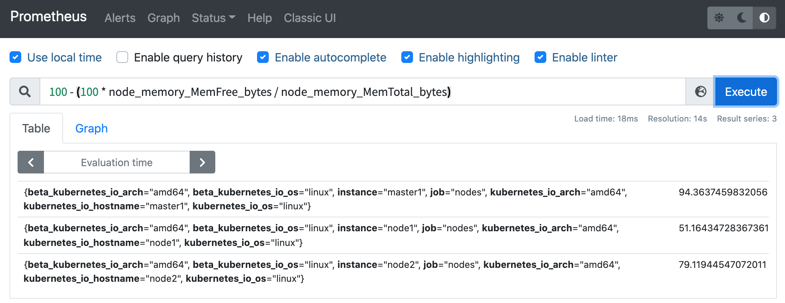

然后现在我们就可以使用记录规则将上面的表达式重新配置。同样在配置报警规则的 `groups` 下面添加如下所示配置：

```yaml
groups:
  - name: recording_rules
    rules:
    - record: job:node_memory_MemFree_bytes:percent
      expr: 100 - (100 * node_memory_MemFree_bytes / node_memory_MemTotal_bytes)
  # 其他报警规则
  - name: test-node-mem
    rules:  # 具体的报警规则
    - alert: NodeMemoryUsage  # 报警规则的名称
      ......
```

这里其实相当于我们为前面的查询表达式配置了一个 `job:node_memory_MemFree_bytes:percent` 的别名，一般来说记录规则的名称可以使用 `:`字符来进行连接，这样的命名方式可以让规则名称更加有意义。更新上面配置并 reload 下 Prometheus 即可让记录规则生效，在 Prometheus 的 Rules 页面正常也可以看到上面添加的记录规则：


现在我们就可以直接使用记录规则的名称 `job:node_memory_MemFree_bytes:percent` 来进行查询了：


由于我们这里的查询语句本身不消耗资源，所以使用记录规则来进行查询差距不大，但是对于需要消耗大量资源的查询语句则提升会非常明显。


> 原文: <https://www.yuque.com/cnych/k8s4/lofwg1fal1p51y3s>