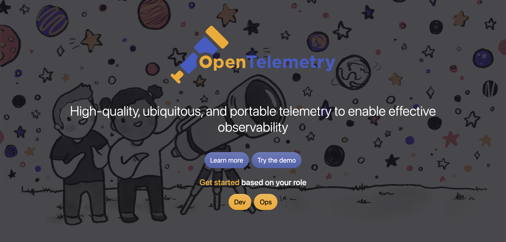

# 45.OpenTelemetry

为了使应用能够可观察，必须对其进行检测。也就是说我们的应用程序必须发出追踪、指标和日志数据。然后必须将经过检测的数据发送到可观察性后端。过去，检测代码的方式会有所不同，因为每个可观察性后端都有自己的检测库和代理，用于向工具发送数据。

这意味着没有用于将数据发送到可观察性后端的**标准化数据格式**。此外，如果一家公司选择切换观测后端，这意味着他们不得不重新检测他们的代码并配置新代理，以便能够将遥测数据发送到新选择的工具。

由于缺乏标准化，最终结果是**缺乏数据可移植性和用户维护代码的高成本**。

## 什么是 OpenTelemetry

认识到标准化的必要性后，云社区聚集在一起，诞生了两个开源项目：[OpenTracing](https://opentracing.io/)（云原生计算基金会 (CNCF) 项目）和 [OpenCensus](https://opencensus.io/)（Google 开源社区项目）。

- `OpenTracing` 提供了供应商中立的 API，用于将遥测数据发送到可观察性后端；但是，它依赖于开发人员实现自己的库来满足规范。
- `OpenCensus` 提供了一组特定于语言的库，开发人员可以使用这些库来检测他们的代码并发送到他们支持的任何一个后端。

为了统一标准，`OpenCensus` 和 `OpenTracing` 在 2019 年 5 月合并成立了 [OpenTelemetry](https://opentelemetry.io/)（简称 `OTel`），作为 CNCF 的孵化项目，`OpenTelemetry` 继承了两者的优点，并且做了更进一步的优化。

`OTel` 的目标是提供一套标准化、与厂商无关的 SDK、API 和工具集，用于将数据摄取、转换和发送到可观测性后端（开源或商业厂商）。

## OpenTelemetry 可以做什么？

`OTel` 拥有来自云提供商、供应商和最终用户的广泛行业支持和采用。它可以为我们提供：

- 每种语言都有一个单一的、与供应商无关的检测库，支持自动（部分语言）和手动检测。
- 一个独立于供应商的收集器二进制文件，可以通过多种方式进行部署。
- 一个端到端的实现，用于生成、发出、收集、处理和导出遥测数据。
- 完全控制你的数据，能够通过配置将数据并行发送到多个目的地。
- 开放标准的语义约定，以确保与供应商无关的数据收集
- 能够并行支持多种[上下文传播格式](https://opentelemetry.io/docs/specs/otel/overview/#context-propagation)，以协助随着标准的发展进行迁移。

通过支持各种[开源和商业协议](https://github.com/open-telemetry/opentelemetry-collector-contrib/tree/main/receiver)、格式和上下文传播机制以及提供 `OpenTracing` 和 `OpenCensus` 项目的 shim 垫片，因此很容易使用 OpenTelemetry。

但是也需要注意 OpenTelemetry 不是像 Jaeger 或 Prometheus 那样的可观察性后端，即 OpenTelemetry 不提供与可观测性相关的后端服务，这类后端服务通常提供的是存储、查询、可视化等服务。相反，它支持将数据导出到各种开源和商业后端。它提供了可插拔的架构，因此可以轻松添加其他技术协议和格式。

> 原文: <https://www.yuque.com/cnych/k8s4/lxdlzdexw6p1gu3c>