# 46.Jenkins

提到基于 Kubernetes 的 CI/CD，可以使用的工具有很多，比如 Jenkins、Gitlab CI 以及新兴的 Drone 之类的，我们这里会使用大家最为熟悉的 Jenkins 来做 CI/CD 的工具。


## 安装

既然要基于 Kubernetes 来做 CI/CD，我们这里最好还是将 Jenkins 安装到 Kubernetes 集群当中，安装的方式也很多，我们这里仍然还是使用手动的方式，这样可以了解更多细节，对应的资源清单文件如下所示：

```yaml
apiVersion: v1
kind: PersistentVolume
metadata:
  name: jenkins-local
  labels:
    app: jenkins
spec:
  accessModes:
    - ReadWriteOnce
  capacity:
    storage: 5Gi
  storageClassName: local-storage
  local:
    path: /data/k8s/jenkins
  persistentVolumeReclaimPolicy: Retain
  nodeAffinity:
    required:
      nodeSelectorTerms:
        - matchExpressions:
            - key: kubernetes.io/hostname
              operator: In
              values:
                - node2
---
apiVersion: v1
kind: PersistentVolumeClaim
metadata:
  name: jenkins-pvc
  namespace: kube-ops
spec:
  storageClassName: local-storage
  accessModes:
    - ReadWriteOnce
  resources:
    requests:
      storage: 5Gi
---
apiVersion: v1
kind: ServiceAccount
metadata:
  name: jenkins
  namespace: kube-ops
---
kind: ClusterRole
apiVersion: rbac.authorization.k8s.io/v1
metadata:
  name: jenkins
rules:
  - apiGroups: ["extensions", "apps"]
    resources: ["deployments", "ingresses"]
    verbs: ["create", "delete", "get", "list", "watch", "patch", "update"]
  - apiGroups: [""]
    resources: ["services"]
    verbs: ["create", "delete", "get", "list", "watch", "patch", "update"]
  - apiGroups: [""]
    resources: ["pods"]
    verbs: ["create", "delete", "get", "list", "patch", "update", "watch"]
  - apiGroups: [""]
    resources: ["pods/exec"]
    verbs: ["create", "delete", "get", "list", "patch", "update", "watch"]
  - apiGroups: [""]
    resources: ["pods/log", "events"]
    verbs: ["get", "list", "watch"]
  - apiGroups: [""]
    resources: ["secrets"]
    verbs: ["get"]
---
apiVersion: rbac.authorization.k8s.io/v1
kind: ClusterRoleBinding
metadata:
  name: jenkins
  namespace: kube-ops
roleRef:
  apiGroup: rbac.authorization.k8s.io
  kind: ClusterRole
  name: jenkins
subjects:
  - kind: ServiceAccount
    name: jenkins
    namespace: kube-ops
---
apiVersion: apps/v1
kind: Deployment
metadata:
  name: jenkins
  namespace: kube-ops
spec:
  selector:
    matchLabels:
      app: jenkins
  template:
    metadata:
      labels:
        app: jenkins
    spec:
      serviceAccount: jenkins
      initContainers:
        - name: fix-permissions
          image: busybox:1.35.0
          command: ["sh", "-c", "chown -R 1000:1000 /var/jenkins_home"]
          securityContext:
            privileged: true
          volumeMounts:
            - name: jenkinshome
              mountPath: /var/jenkins_home
      containers:
        - name: jenkins
          image: jenkins/jenkins:lts-jdk11
          imagePullPolicy: IfNotPresent
          env:
            - name: JAVA_OPTS
              value: -Dhudson.model.DownloadService.noSignatureCheck=true
          ports:
            - containerPort: 8080
              name: web
              protocol: TCP
            - containerPort: 50000
              name: agent
              protocol: TCP
          readinessProbe:
            httpGet:
              path: /login
              port: 8080
            initialDelaySeconds: 60
            timeoutSeconds: 5
            failureThreshold: 12
          volumeMounts:
            - name: jenkinshome
              mountPath: /var/jenkins_home
      volumes:
        - name: jenkinshome
          persistentVolumeClaim:
            claimName: jenkins-pvc
---
apiVersion: v1
kind: Service
metadata:
  name: jenkins
  namespace: kube-ops
  labels:
    app: jenkins
spec:
  selector:
    app: jenkins
  ports:
    - name: web
      port: 8080
      targetPort: web
    - name: agent
      port: 50000
      targetPort: agent
---
apiVersion: networking.k8s.io/v1
kind: Ingress
metadata:
  name: jenkins
  namespace: kube-ops
spec:
  ingressClassName: nginx
  rules:
    - host: jenkins.k8s.local
      http:
        paths:
          - path: /
            pathType: Prefix
            backend:
              service:
                name: jenkins
                port:
                  name: web
```

我们这里使用 `jenkins/jenkins:lts-jdk11` 镜像，这是 jenkins 官方的 Docker 镜像，然后也有一些环境变量，当然我们也可以根据自己的需求来定制一个镜像，比如我们可以将一些插件打包在自定义的镜像当中，可以参考文档：[https://github.com/jenkinsci/docker](https://github.com/jenkinsci/docker)，我们这里使用默认的官方镜像就行，另外一个还需要注意的数据的持久化，将容器的 `/var/jenkins_home` 目录持久化即可，我们这里使用的是 Local PV 的方式。

由于我们这里使用的镜像内部运行的用户 `uid=1000`，所以我们这里挂载出来后会出现权限问题，为解决这个问题，我们同样还是用一个简单的 `initContainer` 来修改下我们挂载的数据目录。

另外由于 jenkens 会对 `update-center.json` 做签名校验安全检查，这里我们需要先提前关闭，否则下面更改插件源可能会失败，通过配置环境变量 `JAVA_OPTS=-Dhudson.model.DownloadService.noSignatureCheck=true` 即可。

另外我们这里还需要使用到一个拥有相关权限的 `serviceAccount：jenkins`，我们这里只是给 jenkins 赋予了一些必要的权限，当然如果你对 serviceAccount 的权限不是很熟悉的话，我们给这个 sa 绑定一个 `cluster-admin` 的集群角色权限也是可以的，当然这样具有一定的安全风险。最后就是通过 Ingress 来暴露我们的服务，这个比较简单。

我们直接来创建 jenkins 的资源清单即可：

```shell
$ kubectl apply -f jenkins.yaml
$ kubectl get pods -n kube-ops -l app=jenkins
NAME                       READY   STATUS    RESTARTS   AGE
jenkins-55c4676f4d-fhmw2   1/1     Running   0          3m5s
$ kubectl logs -f jenkins-55c4676f4d-fhmw2 -n kube-ops
Running from: /usr/share/jenkins/jenkins.war
webroot: /var/jenkins_home/war
# ......
2023-09-07 06:56:26.123+0000 [id=33]    INFO    jenkins.install.SetupWizard#init:

*************************************************************
*************************************************************
*************************************************************

Jenkins initial setup is required. An admin user has been created and a password generated.
Please use the following password to proceed to installation:

278e9dcdcab04d11ae671f7f81f517ba

This may also be found at: /var/jenkins_home/secrets/initialAdminPassword

*************************************************************
*************************************************************
*************************************************************

2023-09-07 06:56:38.572+0000 [id=29]    INFO    jenkins.InitReactorRunner$1#onAttained: Completed initialization
2023-09-07 06:56:38.583+0000 [id=23]    INFO    hudson.lifecycle.Lifecycle#onReady: Jenkins is fully up and running
2023-09-07 06:57:02.555+0000 [id=49]    INFO    h.m.DownloadService$Downloadable#load: Obtained the updated data file for hudson.tasks.Maven.MavenInstaller
2023-09-07 06:57:02.556+0000 [id=49]    INFO    hudson.util.Retrier#start: Performed the action check updates server successfully at the attempt #1
```

看到上面的 `run: Jenkins is fully up and running` 信息就证明我们的 Jenkins 应用以前启动起来了。

然后我们可以通过 Ingress 中定义的域名 `jenkins.k8s.local`(需要做 DNS 解析或者在本地 `/etc/hosts` 中添加映射)来访问 jenkins 服务：

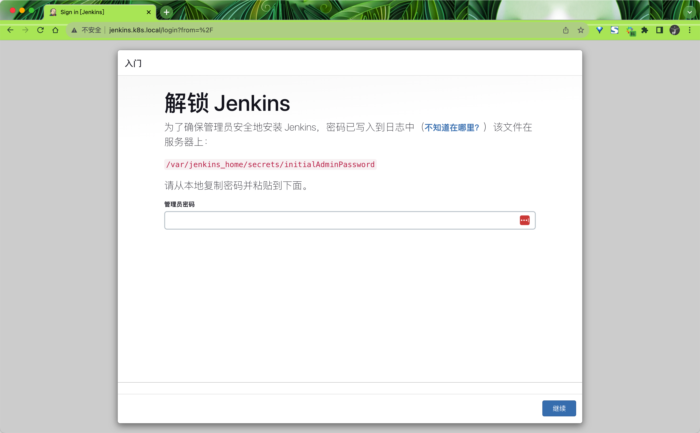

然后可以执行下面的命令获取解锁的管理员密码：

```shell
$ kubectl exec -it jenkins-55c4676f4d-fhmw2 -n kube-ops -- cat /var/jenkins_home/secrets/initialAdminPassword
278e9dcdcab04d11ae671f7f81f517ba   # jenkins启动日志里面也有
```

然后跳过插件安装，选择默认安装插件过程会非常慢（也可以选择安装推荐的插件），点击右上角关闭选择插件。

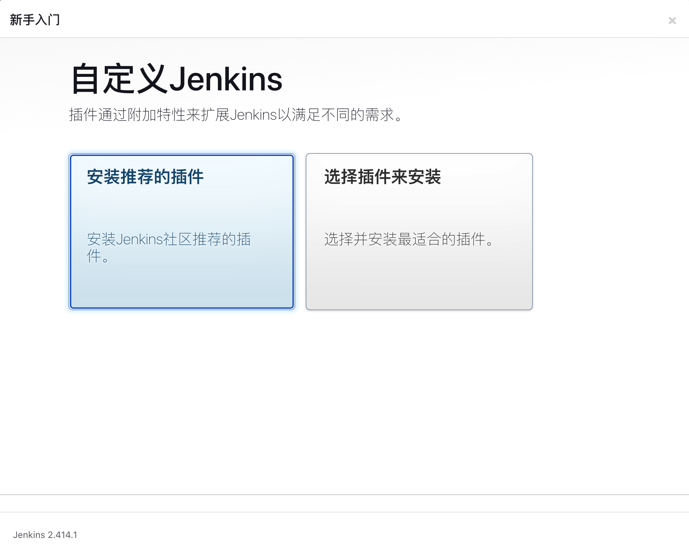

跳过后会直接进入 Jenkins 就绪页面，直接点击开始使用即可：

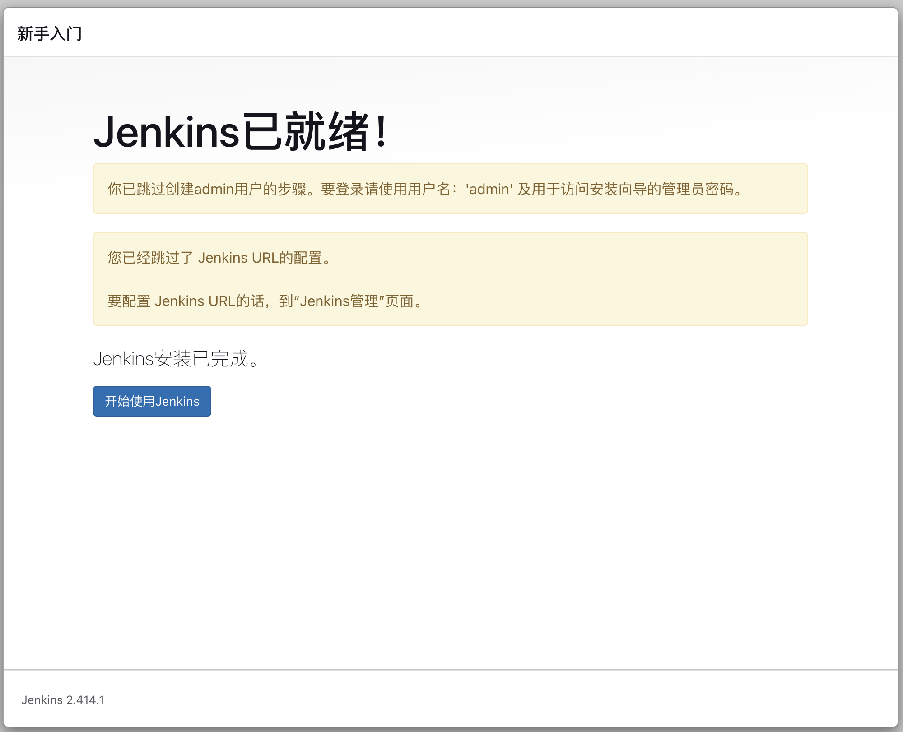

然后就可以进入 Jenkins 主页了。

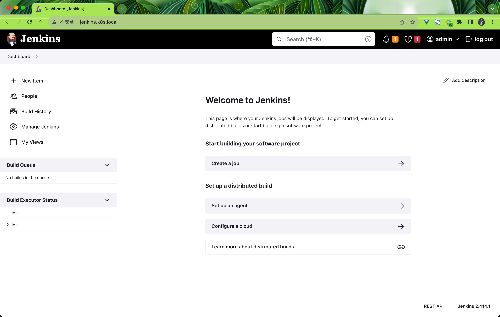

首先安装中文插件（如果想要中文界面的话），搜索 `Localization: Chinese`：


安装重启完成后，会自动跳转到登录页面：

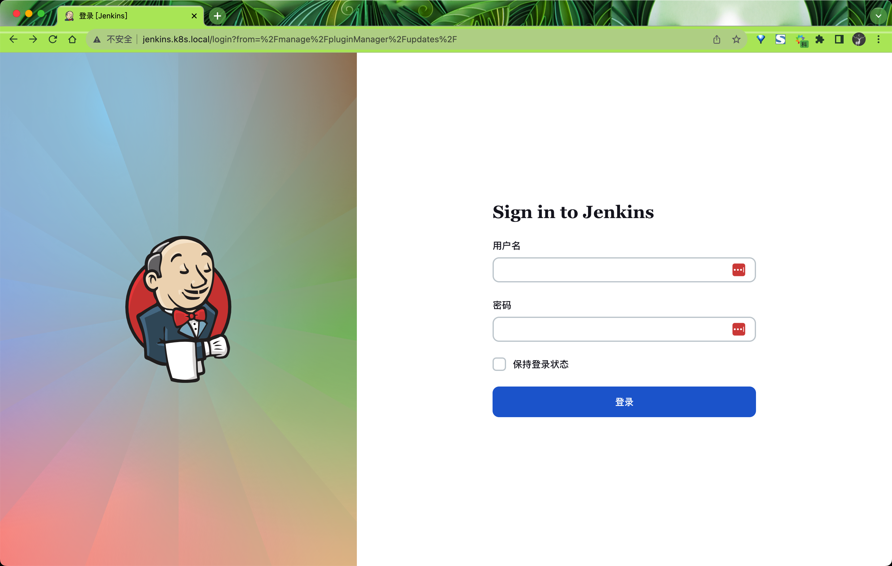

这里还是使用 admin 和前面的初始密码进行登录。然后可以进入用户管理页面 [http://jenkins.k8s.local/user/admin/configure](http://jenkins.k8s.local/user/admin/configure) 修改用户密码：

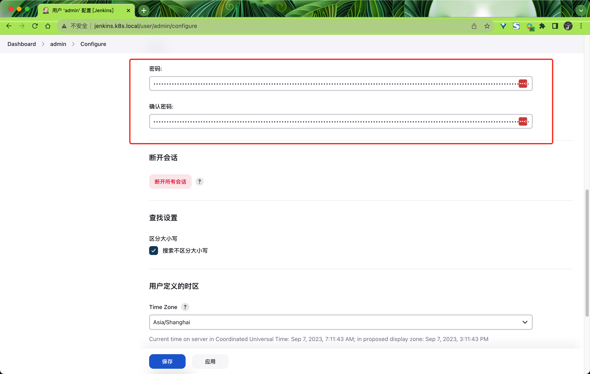

然后就可以使用新的密码登录了。

接下来我们可以安装其他需要的插件，比如 `Pipeline` 插件。`Pipeline` 是 Jenkins 的一个核心插件，它定义了一套 DSL 语言，可以用来编写 Pipeline 脚本，这个脚本可以实现从代码构建到部署的整个流程。在使用 Pipeline 类型的项目时，需要提前安装 Jenkins 的 Pipeline 插件。


安装好插件后新建一个 Pipeline 类型的作业：

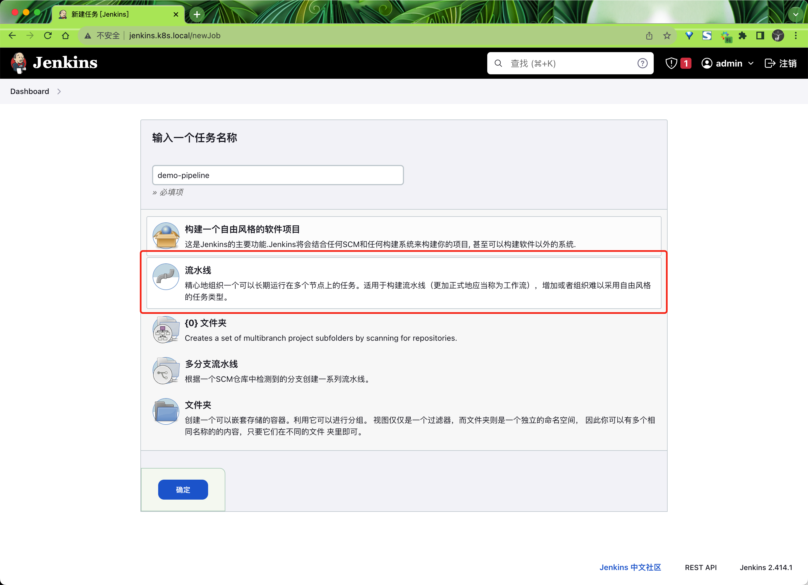

自由风格项目和 Pipeline 类型的项目区别是，构建部分的操作都是在页面上面完成的。Pipeline 的构建任务描述都是通过代码的方式。

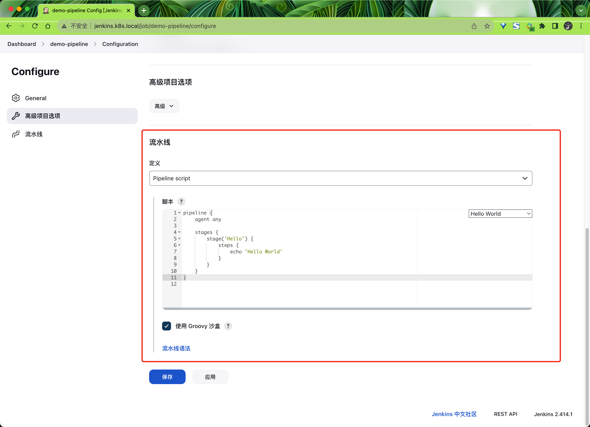

保存后我们可以点击**立即构建**执行这个任务，也可以查看这个任务的执行结果输出：

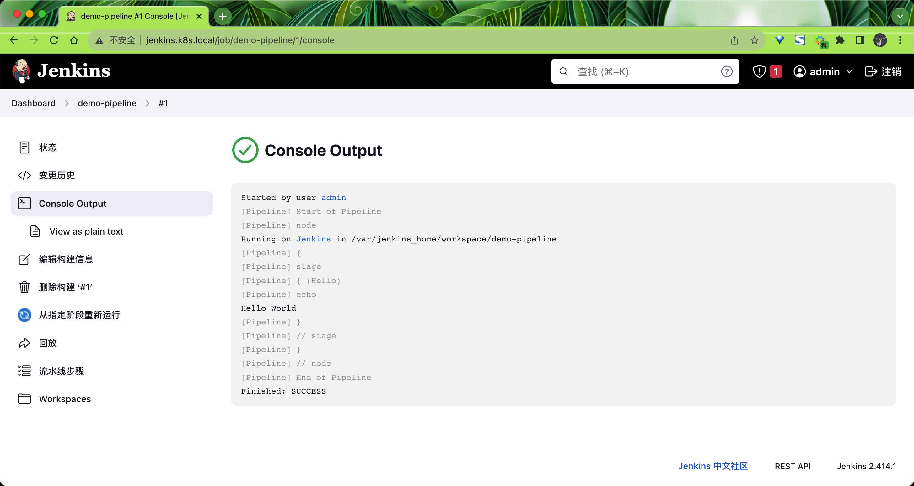


## 架构

Jenkins 安装完成了，接下来我们不用急着就去使用，我们要了解下在 Kubernetes 环境下面使用 Jenkins 有什么好处。

我们知道持续构建与发布是我们日常工作中必不可少的一个步骤，目前大多公司都采用 Jenkins 集群来搭建符合需求的 CI/CD 流程，然而传统的 Jenkins Slave 一主多从方式会存在一些痛点，比如：

- 主 Master 发生单点故障时，整个流程都不可用了
- 每个 Slave 的配置环境不一样，来完成不同语言的编译打包等操作，但是这些差异化的配置导致管理起来非常不方便，维护起来也是比较费劲
- 资源分配不均衡，有的 Slave 要运行的 job 出现排队等待，而有的 Slave 处于空闲状态
- 资源有浪费，每台 Slave 可能是物理机或者虚拟机，当 Slave 处于空闲状态时，也不会完全释放掉资源。

正因为上面的这些种种痛点，我们渴望一种更高效更可靠的方式来完成这个 CI/CD 流程，而 Docker 虚拟化容器技术能很好的解决这个痛点，又特别是在 Kubernetes 集群环境下面能够更好来解决上面的问题，下图是基于 Kubernetes 搭建 Jenkins 集群的简单示意图：


从图上可以看到 `Jenkins Master` 和 `Jenkins Slave` 以 Pod 形式运行在 Kubernetes 集群的 Node 上，Master 运行在其中一个节点，并且将其配置数据存储到一个 Volume 上去，Slave 运行在各个节点上，并且它不是一直处于运行状态，它会按照需求动态的创建并自动删除。

这种方式的工作流程大致为：当 Jenkins Master 接受到 Build 请求时，会根据配置的 Label 动态创建一个运行在 Pod 中的 Jenkins Slave 并注册到 Master 上，当运行完 Job 后，这个 Slave 会被注销并且这个 Pod 也会自动删除，恢复到最初状态。

那么我们使用这种方式带来了哪些好处呢？

- **服务高可用**，当 Jenkins Master 出现故障时，Kubernetes 会自动创建一个新的 Jenkins Master 容器，并且将 Volume 分配给新创建的容器，保证数据不丢失，从而达到集群服务高可用。
- **动态伸缩**，合理使用资源，每次运行 Job 时，会自动创建一个 Jenkins Slave，Job 完成后，Slave 自动注销并删除容器，资源自动释放，而且 Kubernetes 会根据每个资源的使用情况，动态分配 Slave 到空闲的节点上创建，降低出现因某节点资源利用率高，还排队等待在该节点的情况。
- **扩展性好**，当 Kubernetes 集群的资源严重不足而导致 Job 排队等待时，可以很容易的添加一个 Kubernetes Node 到集群中，从而实现扩展。
是不是以前我们面临的种种问题在 Kubernetes 集群环境下面是不是都没有了啊？看上去非常完美。


## Agent 节点

虽然我们上面提到了动态节点的好处，但是还是会有一部分人比较喜欢坚持静态节点的方式，选择静态或者动态的 Jenkins Agent 节点都是可以的。接下来我们就分别来介绍下如何在 Kubernetes 集群中为 Jenkins 提供动静态 Agent 节点。


### 静态节点

首先在 Jenkins 页面 [http://jenkins.k8s.local/computer/new](http://jenkins.k8s.local/computer/new) 新建一个节点：


点击创建后配置节点信息，然后点击保存：

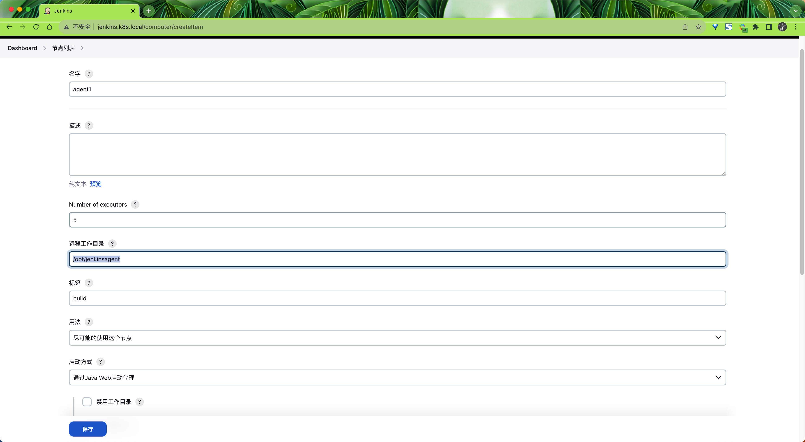

保存后我们可以看到节点已经创建成功了：


然后点击列表中的 `agent1` 名称，进入节点详情页面，在详情页面我们将获取到运行该节点的一些密钥信息，


然后创建一个如下所示的资源清单文件：

```yaml
apiVersion: apps/v1
kind: Deployment
metadata:
  name: jenkins-agent
  namespace: kube-ops
spec:
  selector:
    matchLabels:
      app: jenkins-agent
  template:
    metadata:
      labels:
        app: jenkins-agent
    spec:
      containers:
        - name: agent
          image: jenkins/inbound-agent
          securityContext:
            privileged: true
          imagePullPolicy: IfNotPresent
          env:
            - name: JENKINS_URL
              value: http://jenkins.k8s.local
            - name: JENKINS_SECRET
              value: 9c4c5159b111083705eed5802ceb021cfad002a18dd59c692aa59a9616e6285a
            - name: JENKINS_AGENT_NAME
              value: agent1
            - name: JENKINS_AGENT_WORKDIR
              value: /home/jenkins/workspace
```

上面的清单文件中的 `JENKINS_URL`、`JENKINS_SECRET` 和 `JENKINS_AGENT_WORKDIR` 这些环境变量的值就是上面我们在节点详情页面获取到的信息，然后我们将这个文件应用到集群中：

```shell
$ kubectl apply -f jenkins-agent.yaml
```

创建后正常该 agent 的 Pod 会启动报错，错误日志如下所示：

```shell
INFO: Locating server among [http://jenkins.k8s.local/]
Sep 07, 2023 7:55:51 AM hudson.remoting.jnlp.Main$CuiListener error
SEVERE: Failed to connect to http://jenkins.k8s.local/tcpSlaveAgentListener/: jenkins.k8s.local
java.io.IOException: Failed to connect to http://jenkins.k8s.local/tcpSlaveAgentListener/: jenkins.k8s.local
        at org.jenkinsci.remoting.engine.JnlpAgentEndpointResolver.resolve(JnlpAgentEndpointResolver.java:216)
        at hudson.remoting.Engine.innerRun(Engine.java:760)
        at hudson.remoting.Engine.run(Engine.java:543)
Caused by: java.net.UnknownHostException: jenkins.k8s.local
        at java.base/java.net.AbstractPlainSocketImpl.connect(Unknown Source)
        at java.base/java.net.Socket.connect(Unknown Source)
        at java.base/sun.net.NetworkClient.doConnect(Unknown Source)
        at java.base/sun.net.www.http.HttpClient.openServer(Unknown Source)
        at java.base/sun.net.www.http.HttpClient.openServer(Unknown Source)
        at java.base/sun.net.www.http.HttpClient.<init>(Unknown Source)
        at java.base/sun.net.www.http.HttpClient.New(Unknown Source)
        at java.base/sun.net.www.http.HttpClient.New(Unknown Source)
        at java.base/sun.net.www.protocol.http.HttpURLConnection.getNewHttpClient(Unknown Source)
        at java.base/sun.net.www.protocol.http.HttpURLConnection.plainConnect0(Unknown Source)
        at java.base/sun.net.www.protocol.http.HttpURLConnection.plainConnect(Unknown Source)
        at java.base/sun.net.www.protocol.http.HttpURLConnection.connect(Unknown Source)
        at org.jenkinsci.remoting.engine.JnlpAgentEndpointResolver.resolve(JnlpAgentEndpointResolver.java:213)
        ... 2 more
```

这其实是因为我们配置的 `jenkins.k8s.local` 域名是一个自定义的域名，需要在 K8s 集群中解析的话，我们还需要在 CoreDNS 中去添加一条 hosts 映射：

```bash
$ kubectl edit cm coredns -n kube-system

# Please edit the object below. Lines beginning with a '#' will be ignored,
# and an empty file will abort the edit. If an error occurs while saving this file will be
# reopened with the relevant failures.
#
apiVersion: v1
data:
  Corefile: |
    .:53 {
        errors
        health {
           lameduck 5s
        }
        hosts {
          10.206.16.10 jenkins.k8s.local
          fallthrough
        }
#  ......
kind: ConfigMap
```

但其实还有更简单的方式，那就是直接将 `JENKINS_URL` 值替换为 Jenkins 的 Service 地址 `http://jenkins.kube-ops.svc.cluster.local:8080` 即可，这样就不需要在 CoreDNS 中添加 hosts 映射了。

正常现在的 Jenkins Agent Pod 应该是正常运行的，我们可以通过下面的命令查看：

```shell
$ kubectl get pods -n kube-ops -l app=jenkins-agent
NAME                             READY   STATUS    RESTARTS   AGE
jenkins-agent-76884cd44c-dd9ds   1/1     Running   0          2m32s
```

再次查看节点列表，我们可以看到节点已经在线了：


接下来我们再创建一个 Pipeline 类型的作业，然后在 Pipeline 脚本中添加下面的内容：


这里我们定义的流水线脚本中，我们使用到了 `agent` 关键字，这个关键字的作用就是指定这个流水线的运行环境，这里我们指定的是 `build` 这个标签，也就是我们上面创建的 agent1 这个节点，这样这个流水线就会在这个节点上运行。

点击保存后，我们可以点击**立即构建**来执行这个流水线，然后我们可以查看这个流水线的执行结果：

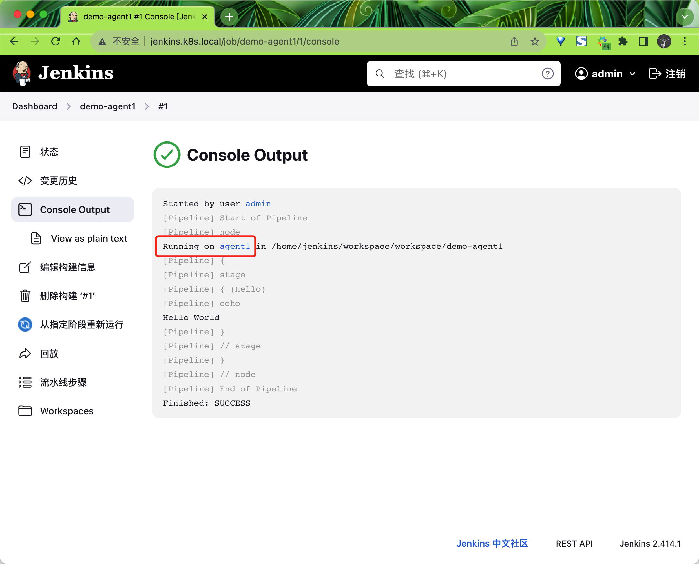

这样我们就可以在 Jenkins 中使用这个静态节点来构建任务了。


### 动态节点

除了静态节点之外，我们还可以使用动态节点的方式来构建任务，这样可以更好的利用资源，我们这里使用的是 Kubernetes 的方式来创建动态节点，这样我们就可以在 Jenkins 中使用动态节点来构建任务了。

第 1 步. 首先需要安装 [kubernetes 插件](https://github.com/jenkinsci/kubernetes-plugin)。

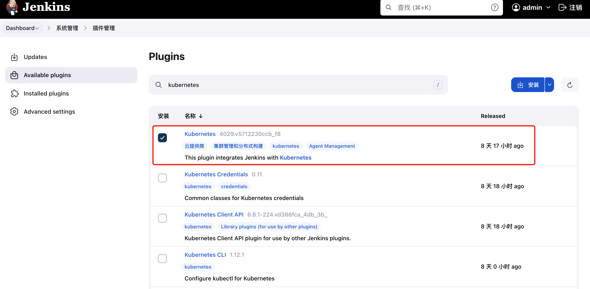

第 2 步. 安装完毕后，进入 `http://jenkins.k8s.local/manage/cloud/` 页面：

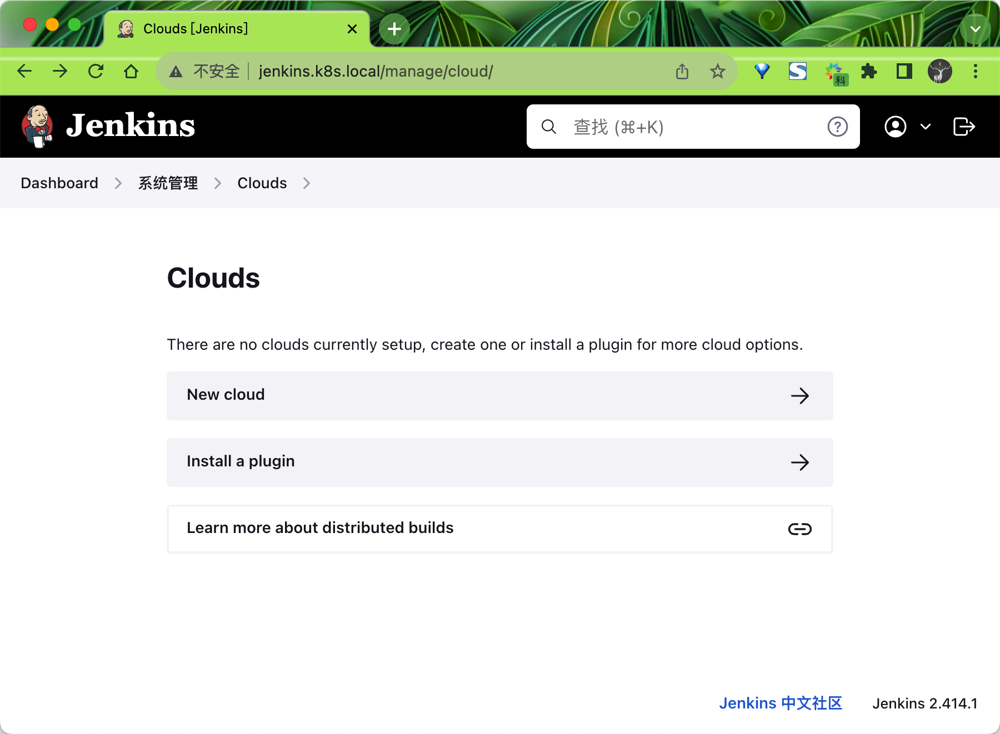

在该页面点击 `New cloud` 新建一个 Cloud 服务：


这里注意一定要选择上 `Kubernetes` 这个 Type，然后点击 `Create` 按钮，然后我们就可以看到下面的配置页面了：


首先配置连接 Kubernetes APIServer 的地址，由于我们的 Jenkins 运行在 Kubernetes 集群中，所以可以使用 Service 的 DNS 形式进行连接 `https://kubernetes.default.svc.cluster.local`：

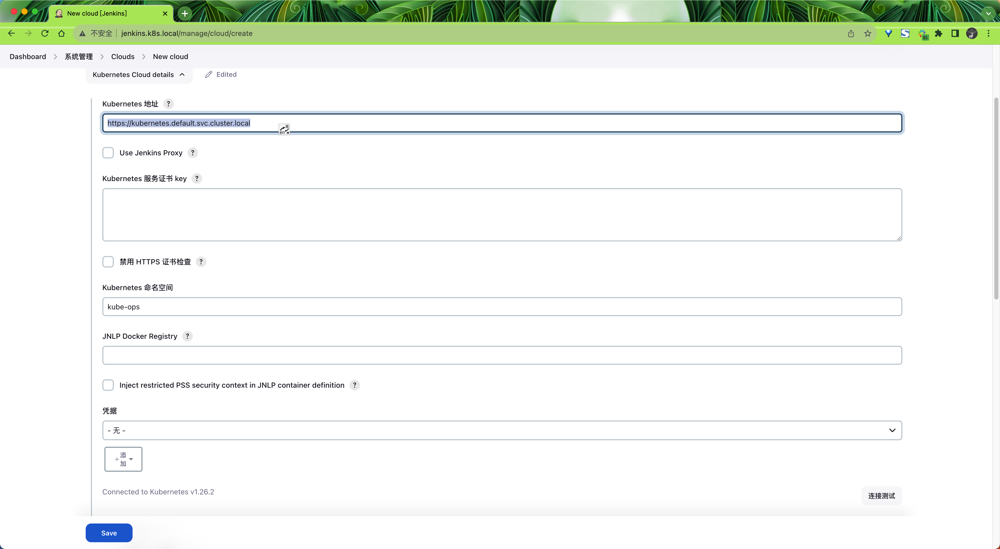

命名空间这里填 `kube-ops`，然后点击 `连接测试`，如果出现 `Connected to Kubernetes v1.26.2` 这样的提示信息证明 Jenkins 已经可以和 Kubernetes 系统正常通信了。

然后下方的 Jenkins URL 地址为 `http://jenkins.kube-ops.svc.cluster.local:8080`，根据上面创建的 jenkins 的服务名填写，包括下面的 Jenkins 通道，默认是 50000 端口（要注意是 TCP，所以不要填写 http）：

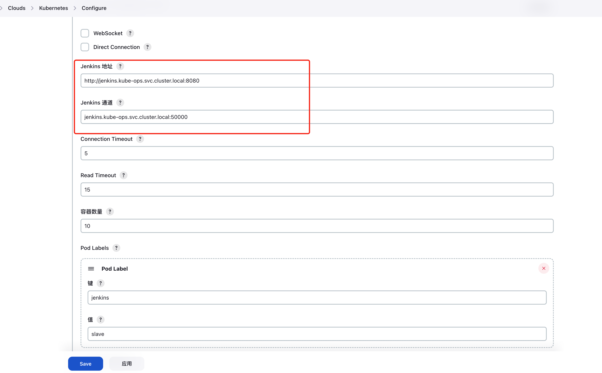

然后点击最后的 `save` 按钮保存配置。到这里我们的 Kubernetes 插件就算配置完成了。


## 测试

Kubernetes 插件的配置工作完成了，接下来我们就来添加一个 Job 任务，看是否能够在 Slave Pod 中执行，任务执行完成后看 Pod 是否会被销毁。

在 Jenkins 首页点击 `新建任务`，创建一个测试的任务，同样还是选择 `Pipeline` 类型的任务，这次我们需要使用的流水线脚本就更复杂了，如下所示：

```groovy
pipeline{
    agent{
        kubernetes{
            label "test01"
            cloud 'Kubernetes'
            yaml '''
---
kind: Pod
apiVersion: v1
metadata:
  labels:
    k8s-app: jenkins-agent
  name: jenkins-agent
  namespace: kube-ops
spec:
containers:
  - name: jenkinsagent
    image: jenkins/inbound-agent
    imagePullPolicy: IfNotPresent
'''
        }
    }

    stages{
        stage("Hello"){
          steps{
            script{
              echo "Hello Slave Pod on Kubernetes!"
            }
          }
        }
    }
}
```

这次的脚本中定义的执行 agent 就比较复杂了，通过一个 `kubernetes` 属性来指定这个流水线的运行环境，然后通过 `yaml` 属性来定义这个运行 Pod 的清单文件，这里我们定义的是一个简单的 Pod，然后我们将这个 Pod 部署到 `kube-ops` 这个命名空间中，这样我们就可以在这个 Pod 中运行我们的 Jenkins Slave 了，需要注意 `cloud` 后面的值需要和前面我们定义的 Cloud 服务名称一致。

最后点击保存，同样我们可以点击左侧的 `立即构建` 来执行这个任务，然后我们可以查看这个任务的执行结果：

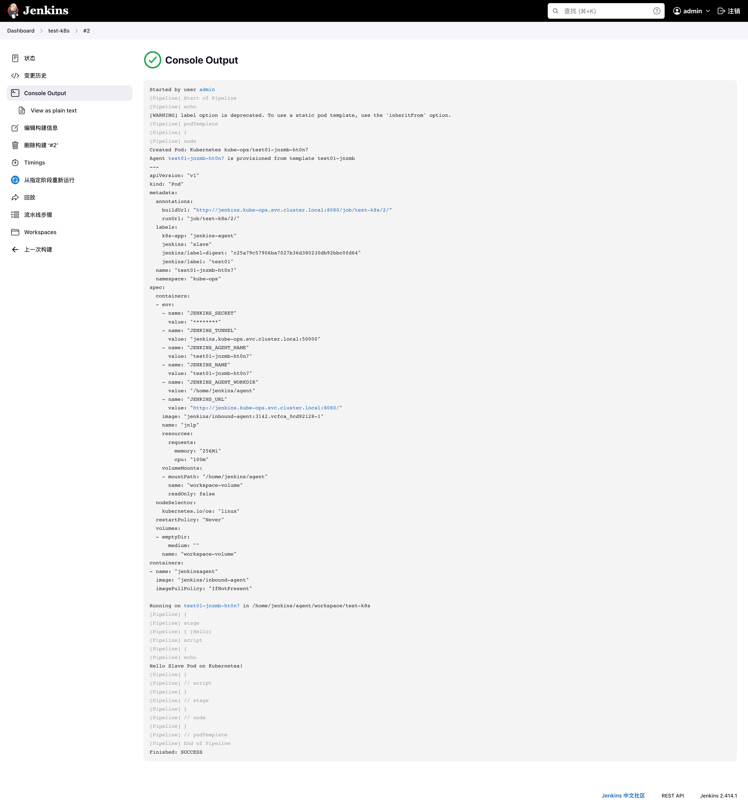

虽然我们在这里的脚本中定义的 Pod 非常简单，但可以看到 Jenkins 会帮我们配置一些默认的环境变量。当任务执行的过程中我们也可以观察 Kubernetes 集群中的 Pod 变化：

```shell
$ kubectl get pods -n kube-ops -w
NAME                              READY   STATUS              RESTARTS      AGE
jenkins-55c4676f4d-fhmw2          1/1     Running             3 (12m ago)   91m
jenkins-agent-76884cd44c-dd9ds    1/1     Running             0             22m
test01-jnzmb-ht0n7                0/1     Pending             0             0s
test01-jnzmb-ht0n7                0/1     Pending             0             0s
test01-jnzmb-ht0n7                0/1     ContainerCreating   0             0s
test01-jnzmb-ht0n7                1/1     Running             0             1s
test01-jnzmb-ht0n7                1/1     Terminating         0             3s
test01-jnzmb-ht0n7                0/1     Terminating         0             4s
test01-jnzmb-ht0n7                0/1     Terminating         0             4s
test01-jnzmb-ht0n7                0/1     Terminating         0             4s
```

我们可以看到在我们点击立刻构建的时候可以看到一个新的 Pod：`test01-jnzmb-ht0n7` 被创建了，这就是我们的 Jenkins Slave。当任务构建完抽这个 Slave Pod 也会自动删除。

到这里我们就完成了使用 Kubernetes 动态生成 Jenkins Slave 的方法。


> 原文: <https://www.yuque.com/cnych/k8s4/nyzwgryxmiowhytn>