# 49.Argo CD

本节我们将来学习 GitOps 的相关知识。


## GitOps 是什么？

你可能听说过 DevOps，或者 AIOps、ChatOps 等，那么 GitOps 又是什么呢？

[GitOps](https://www.weave.works/technologies/gitops/) 是 Weaveworks 提出的一种持续交付方式，它的核心思想是将应用系统的声明性基础架构和应用程序存放在 Git 版本库中。**将 Git 作为交付流水线的核心**，每个开发人员都可以提交拉取请求（Pull Request）并使用 Git 来加速和简化 Kubernetes 的应用程序部署和运维任务。通过使用像 Git 这样的简单工具，开发人员可以更高效地将注意力集中在创建新功能而不是运维相关任务上（例如，应用系统安装、配置、迁移等）。


### 主要优点

通过 GitOps，当使用 Git 提交基础架构代码更改时，自动化的交付流水线会将这些更改应用到应用程序的实际基础架构上。但是 GitOps 的想法远不止于此，它还会使用工具将整个应用程序的实际生产状态与基础架构源代码进行比较，然后它会告诉集群哪些基础架构源代码与实际环境不匹配。

通过应用 GitOps 最佳实践，应用系统的基础架构和应用程序代码都有“真实来源”——其实是将基础架构和应用程序代码都存放在 gitlab、或者 github 等版本控制系统上，这使开发团队可以提高开发和部署速度并提高应用系统可靠性。

将 GitOps 理论方法应用在持续交付流水线上，有诸多优势：

- 安全的云原生 CI/CD 流水线模型
- 更快的部署时间和恢复时间
- 稳定且可重现的回滚（例如，根据 Git 恢复/回滚/fork）
- 与监控和可视化工具相结合，对已经部署的应用进行全方位的监控


### 应用场景

作为 CI/CD 流水线的方案，由于没有单一工具可以完成流水线中所需的所有工作，因此可以自由地为流水线的不同部分选择最佳工具。可以从开源生态系统中选择一组工具，也可以从封闭源中选择一组工具，或者根据使用情况，甚至可以将它们组合在一起，其实，创建流水线最困难的部分是将所有部件粘合在一起。

不管如何选择构造自己的交付流水线，将基于 Git（或者其他版本控制工具）的 GitOps 最佳实践应用在交付流水线中都是一个不二选择，这将使构建持续交付流水线，以及后续的发布变得更加容易，这不仅从技术角度而且从文化角度来看都是如此。

当然，GitOps 也不是万能的，它也有相应的应用场景。

**不可变基础设施**

> 应用都需要运行在多台机器上，它们被组织成不同的环境，例如开发环境、测试环境和生产环境等。需要将相同的应用部署到不同的机器上，通常需要系统管理员确保所有的机器都处于相同的状态。接着所有的修改、补丁、升级需要在所有的机器中进行。随着时间的推移，很难再确保所有的机器处于相同的状态，同时越来越容易出错。这就是传统的可变架构中经常出现的问题。这时我们有了不可变架构，它将整个机器环境打包成一个单一的不可变单元，而不是传统方式仅仅打包应用。这个单元包含了之前所说的整个环境栈和应用所有的修改、补丁和升级，这就解决了前面的问题。 —— 摘自 InfoQ 的《关于不可变架构以及为什么需要不可变架构》作者 百占辉


**不可变基础设施**这一概念不是刚刚才提出来的，它也不是必须需要容器技术。然而，通过容器，它变得更易于理解，更加实用，并引起了业内广泛注意。不可变基础设施让我们以全新的方式理解和面对应用系统，尤其是使以微服务为代表的分布式系统在部署、运维等方面变得不那么复杂，而有很好的可控性。

那么，如何比较方便地在实际的生产过程中应用不可变基础设施，这给业界也提出了另外一个问题，GitOps 是在 Kubernetes 的应用实践中出现的，GitOps 需要依托于不可变基础架构才能发挥其作用。在一定程度上说，不可变基础架构为 GitOps 的出现创造了必要的条件，反过来 GitOps 应用 Kubernetes 的容器编排能力，能够迅速的使用镜像搭建出应用系统所需的组件。

**声明性容器编排**

Kubernetes 作为一个云原生的编排系统，可以把它的**声明性**看作是**代码**，声明意味着配置由一组事实状态而不是一组指令组成，例如**有十个 redis 服务器**，而不是**启动十个 redis 服务器，告诉我它是否有效**。

借助 Kubernetes 的声明性特点，应用系统的整个配置文件集可以在 Git 库中进行版本控制。通过使用 Git 库，应用程序更容易部署到 Kubernetes 中，以及进行版本回滚。更重要的是，当灾难发生时，集群的基础架构可以从 Git 库中可靠且快速地恢复。

Kubernetes 等云原生工具的声明性体现在可以对实例、容器、网络、存储、CPU 等配置通过一组代码方便的表达出来，Kubernetes 等云原生工具可以利用这些配置代码运行出来一套基于容器的应用系统。

GitOps 充分利用了不可变基础设施和声明性容器编排，通过 GitOps 可以轻松地管理多个应用部署。为了最大限度地降低部署后的变更风险，无论是有意还是偶然的“配置差异”，GitOps 构建了一个可重复且可靠的部署过程，在整个应用系统宕机或者损坏情况下，为快速且完全恢复提供了所需条件。


### 基本原则

以下是几条在云原生环境中，GitOps 的一些基本原则：

-  **任何能够被描述的内容都必须存储在 Git 库中**：通过使用 Git 作为存储声明性基础架构和应用程序代码的存储仓库，可以方便地监控集群，以及检查比较实际环境的状态与代码库上的状态是否一致。所以，我们的目标是描述系统相关的所有内容：策略，代码，配置，甚至监控事件和版本控制等，并且将这些内容全部存储在版本库中，在通过版本库中的内容构建系统的基础架构或者应用程序的时候，如果没有成功，则可以迅速的回滚，并且重新来过。 
-  **不应直接使用 kubectl 命令**：一般不提倡在命令行中直接使用 kubectl 命令操作执行部署基础架构或应用程序到集群中。还有一些开发者使用 CI 工具驱动应用程序的部署，但如果这样做，可能会给生产环境带来潜在不可预测的风险。 
-  **调用 Kubernetes 的 API 接口或者控制器应该遵循 Operator 模式**：集群的状态和 Git 库中的配置文件等要保持一致，并且查看分析它们之间的状态差异。 

Git 是 GitOps 形成的最基础的内容，就像第一条原则**任何能够被描述的内容都必须存储在 Git 库中**描述的那样：通过使用 Git 作为存储声明性基础架构和应用程序代码的存储仓库，可以方便地监控集群，以及检查比较实际环境的状态与代码库上的状态是否一致。所以，我们的目标是描述系统相关的所有内容：策略、代码、配置，甚至监控事件和版本控制等，并且将这些内容全部存储在版本库中，在通过版本库中的内容构建系统的基础架构或者应用程序的时候，如果没有成功，则可以迅速的回滚，并且重新来过。


### 将变更部署到集群

目前大多数 CI/CD 工具都使用基于 push 推送的模型，基于推送的流水线意味着代码从 CI 系统开始，通过一系列构建测试等最终生成镜像，最后手动使用 kubectl 将变更推送到 Kubernetes 集群。

如下图所示是一条典型的 push 模式的 CI/CD 流水线，CI 工具负责运行测试、构建镜像、检查 CVE 并将新镜像重新部署至集群当中。


GitOps 方法的区别在于主要使用的是 pull 流水线模式，Git 仓库是 pull 模式的核心，它存储应用程序和配置文件。开发人员将更新的代码推送到 Git 码 代库，CI 工具获取更改并最终构建成 Docker 镜像。GitOps 检测到有镜像，从存储库中提取新镜像，然后在 Git 配置仓库中更新其 YAML。然后，GitOps 检测到集群状态已过期，则从配置库中提取已更改的清单，并将新镜像部署到集群中。


### GitOps 流水线

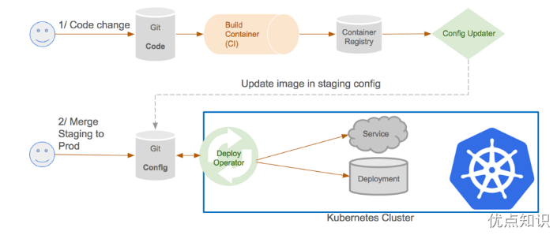

上图中我们可以看到部署的相关操作都是围绕 Git 仓库工作的，在“拉式流水线”中提到过，开发人员将更新的代码推送到 Git 代码仓库，CI 工具获取变更并最终构建成 Docker 镜像，GitOps 的 `Config Updater` 检测到有镜像更新，从存储库中提取新镜像，然后在 Git 配置仓库中更新其 YAML。然后，GitOps 的 `Deploy Operator` 会检测到集群中应用已过期，并从配置库中提取已更改的清单，并将新镜像部署到集群中。

使用集群内部的 Deploy Operator，相关凭据不会暴露到集群外部。一旦将 Deploy Operator 安装到集群与 Git 仓库建立连接，线上环境中的任何更改都将通过具有完全回滚的 Git pull 请求以及 Git 提供的方便审计日志完成。

**状态同步**

由于没有单一工具可以完成流水线中所需的所有工作，可以从开源生态系统中选择一组工具，也可以从封闭源中选择一组工具，或者根据使用情况，甚至可以将它们组合在一起，其实，创建流水线最困难的部分是将所有部件粘合在一起。要实现 GitOps，必须要开发出新的组件，用于粘合这些工具，实现拉式交付流水线。

部署和发布自动化是应用落实 GitOps，实施交付流水线工作的基础。当开发人员通过 Git 更新配置文件的时候，GitOps 流水线要自动根据最新的配置文件状态更新线上环境，而且 GitOps 还要能够实时比对 Git 仓库中配置文件最新的状态与线上环境最新的状态保持一致。

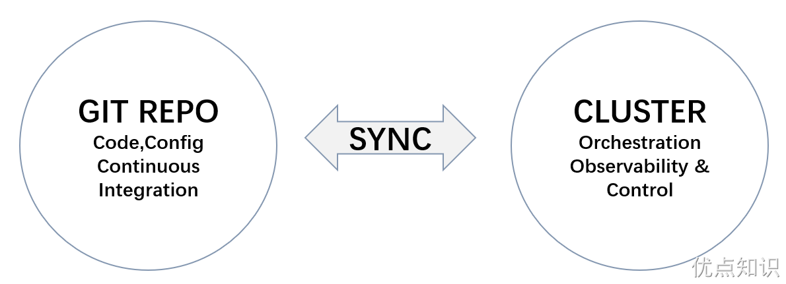

上面提到了两个名词：`Config Updater` 和 `Deploy Operator`，根据 GitOps 的实践，Config Updater 和 Deploy Operator 是需要进行设计开发的，它们是实现 GitOps 流水线的关键组件。GitOps 赋予了它们神奇的魔法，它们既是自动化容器升级和发布到线上环境的工具，可能也要负责服务、部署、网络策略甚至路由规则等任务。因此，Config Updater 和 Deploy Operator 是映射代码、服务和运行集群之间所有关系的**粘合剂**。

当然，你可以根据具体的设计，赋予各种其他的功能，但是**自动同步是一定需要的，确保如果对存储库进行任何变更，这些更改将自动部署到线上环境中**。

**合规性和安全性**

开发人员或者运维人员通过 Git 操作系统配置和应用程序的新建和更新等。通过 Git 客户端 `git commit/git merge` 的所有操作都会在 Git 库记录下来，审计员可以查看 Git，看看谁做了任何更改，何时以及为何以及如何影响正在运行的系统应用。当然，可以根据自身的需求定制不同的交付合规性。相较于直接进入服务器操作或者通过 Kubectl 操作集群，Git 记录了每一个操作步骤，这些可以为合规性和审计提供完整的操作日志。

**角色和权限控制**

几乎所有的 Git 库都提供角色和权限控制，与开发和运维无关的人员没有权限操作 Git 库。而不是直接把服务器或者集群的操作权限暴露出去，这样特别容易引起安全泄露。


## Argo CD

[Argo CD](https://argoproj.github.io/argo-cd) 是一个为 Kubernetes 而生的，遵循声明式 GitOps 理念的持续部署工具。Argo CD 可在 Git 存储库更改时自动同步和部署应用程序。

Argo CD 遵循 GitOps 模式，使用 Git 仓库作为定义所需应用程序状态的真实来源，Argo CD 支持多种 Kubernetes 清单：

- kustomize
- helm charts
- ksonnet applications
- jsonnet files
- Plain directory of YAML/json manifests
- Any custom config management tool configured as a config management plugin

Argo CD 可在指定的目标环境中自动部署所需的应用程序状态，应用程序部署可以在 Git 提交时跟踪对分支、标签的更新，或固定到清单的指定版本。


### 架构


Argo CD 是通过 Kubernetes 控制器来实现的，它持续 watch 正在运行的应用程序并将当前的实时状态与所需的目标状态（ Git 存储库中指定的）进行比较。已经部署的应用程序的实际状态与目标状态有差异，则被认为是 `OutOfSync` 状态，Argo CD 会报告显示这些差异，同时提供工具来自动或手动将状态同步到期望的目标状态。在 Git 仓库中对期望目标状态所做的任何修改都可以自动应用反馈到指定的目标环境中去。

下面简单介绍下 Argo CD 中的几个主要组件：

**API 服务**：API 服务是一个 gRPC/REST 服务，它暴露了 Web UI、CLI 和 CI/CD 系统使用的接口，主要有以下几个功能：

- 应用程序管理和状态报告
- 执行应用程序操作（例如同步、回滚、用户定义的操作）
- 存储仓库和集群凭据管理（存储为 K8s Secrets 对象）
- 认证和授权给外部身份提供者
- RBAC
- Git webhook 事件的侦听器/转发器

**仓库服务**：存储仓库服务是一个内部服务，负责维护保存应用程序清单 Git 仓库的本地缓存。当提供以下输入时，它负责生成并返回 Kubernetes 清单：

- 存储 URL
- revision 版本（commit、tag、branch）
- 应用路径
- 模板配置：参数、ksonnet 环境、helm values.yaml 等

**应用控制器**：应用控制器是一个 Kubernetes 控制器，它持续 watch 正在运行的应用程序并将当前的实时状态与所期望的目标状态（repo 中指定的）进行比较。它检测应用程序的 `OutOfSync` 状态，并采取一些措施来同步状态，它负责调用任何用户定义的生命周期事件的钩子（PreSync、Sync、PostSync）。


### 功能

- 自动部署应用程序到指定的目标环境
- 支持多种配置管理/模板工具（Kustomize、Helm、Ksonnet、Jsonnet、plain-YAML）
- 能够管理和部署到多个集群
- SSO 集成（OIDC、OAuth2、LDAP、SAML 2.0、GitHub、GitLab、Microsoft、LinkedIn）
- 用于授权的多租户和 RBAC 策略
- 回滚/随时回滚到 Git 存储库中提交的任何应用配置
- 应用资源的健康状况分析
- 自动配置检测和可视化
- 自动或手动将应用程序同步到所需状态
- 提供应用程序活动实时视图的 Web UI
- 用于自动化和 CI 集成的 CLI
- Webhook 集成（GitHub、BitBucket、GitLab）
- 用于自动化的 AccessTokens
- PreSync、Sync、PostSync Hooks，以支持复杂的应用程序部署（例如蓝/绿和金丝雀发布）
- 应用程序事件和 API 调用的审计
- Prometheus 监控指标
- 用于覆盖 Git 中的 ksonnet/helm 参数


### 核心概念

- **Application**：应用，一组由资源清单定义的 Kubernetes 资源，这是一个 CRD 资源对象
- **Application source type**：用来构建应用的工具
- **Target state**：目标状态，指应用程序所需的期望状态，由 Git 存储库中的文件表示
- **Live state**：实时状态，指应用程序实时的状态，比如部署了哪些 Pods 等真实状态
- **Sync status**：同步状态表示实时状态是否与目标状态一致，部署的应用是否与 Git 所描述的一样？
- **Sync**：同步指将应用程序迁移到其目标状态的过程，比如通过对 Kubernetes 集群应用变更
- **Sync operation status**：同步操作状态指的是同步是否成功
- **Refresh**：刷新是指将 Git 中的最新代码与实时状态进行比较，弄清楚有什么不同
- **Health**：应用程序的健康状况，它是否正常运行？能否为请求提供服务？
- **Tool**：工具指从文件目录创建清单的工具，例如 Kustomize 或 Ksonnet 等
- **Configuration management tool**：配置管理工具
- **Configuration management plugin**：配置管理插件


### 安装

当然前提是需要有一个 kubectl 可访问的 Kubernetes 的集群，直接使用下面的命令即可，这里我们安装最新的 v2.8.4 版本：

```shell
$ kubectl create namespace argocd
$ kubectl apply -n argocd -f https://raw.githubusercontent.com/argoproj/argo-cd/v2.8.4/manifests/install.yaml
```

如果你要用在生产环境，则可以使用下面的命令部署一个 HA 高可用的版本：

```shell
$ kubectl create namespace argocd
$ kubectl apply -n argocd -f https://raw.githubusercontent.com/argoproj/argo-cd/v2.8.4/manifests/ha/install.yaml
```

这将创建一个新的命名空间 argocd，Argo CD 的服务和应用资源都将部署到该命名空间。

```shell
$ kubectl get pods -n argocd
NAME                                                READY   STATUS    RESTARTS   AGE
argocd-application-controller-0                     1/1     Running   0          103s
argocd-applicationset-controller-68b9bdbd8b-jzcpf   1/1     Running   0          103s
argocd-dex-server-6b7745757-6mxwk                   1/1     Running   0          103s
argocd-notifications-controller-5b56f6f7bb-jqpng    1/1     Running   0          103s
argocd-redis-f4cdbff57-dr8jc                        1/1     Running   0          103s
argocd-repo-server-c4f79b4d6-7nh6n                  1/1     Running   0          103s
argocd-server-895675597-fr42g                       1/1     Running   0          103s
```

> 如果你对 UI、SSO、多集群管理这些特性不感兴趣，只想把应用变更同步到集群中，那么可以直接安装核心组件即可：`kubectl apply -n argocd -f https://raw.githubusercontent.com/argoproj/argo-cd/v2.8.4/manifests/core-install.yaml`。


然后我们可以在本地（选择对应的版本）安装 CLI 工具方便操作 Argo CD：

```shell
$ curl -sSL -o /usr/local/bin/argocd https://github.com/argoproj/argo-cd/releases/download/v2.8.4/argocd-linux-amd64
```

为 argocd CLI 赋予可执行权限：

```shell
$ chmod +x /usr/local/bin/argocd
```

现在我们就可以使用 `argocd` 命令了。如果你是 Mac，则可以直接使用 `brew install argocd` 进行安装。

Argo CD 会运行一个 gRPC 服务（由 CLI 使用）和 HTTP/HTTPS 服务（由 UI 使用），这两种协议都由 `argocd-server` 服务在以下端口进行暴露：

- 443 - gRPC/HTTPS
- 80 - HTTP（重定向到 HTTPS）

我们可以通过配置 Ingress 的方式来对外暴露服务，其他 Ingress 控制器的配置可以参考官方文档 [https://argo-cd.readthedocs.io/en/stable/operator-manual/ingress/](https://argo-cd.readthedocs.io/en/stable/operator-manual/ingress/) 进行配置。

Argo CD 在同一端口 (443) 上提供多个协议 (gRPC/HTTPS)，所以当我们为 argocd 服务定义单个 nginx ingress 对象和规则的时候有点麻烦，因为 `nginx.ingress.kubernetes.io/backend-protocol` 这个 annotation 只能接受一个后端协议（例如 HTTP、HTTPS、GRPC、GRPCS）。

为了使用单个 ingress 规则和主机名来暴露 Argo CD APIServer，必须使用 `nginx.ingress.kubernetes.io/ssl-passthrough` 这个 annotation 来传递 TLS 连接并校验 Argo CD APIServer 上的 TLS。

```yaml
apiVersion: networking.k8s.io/v1
kind: Ingress
metadata:
  name: argocd-server-ingress
  namespace: argocd
  annotations:
    nginx.ingress.kubernetes.io/force-ssl-redirect: "true"
    nginx.ingress.kubernetes.io/ssl-passthrough: "true"
spec:
  ingressClassName: nginx
  rules:
    - host: argocd.k8s.local
      http:
        paths:
          - path: /
            pathType: Prefix
            backend:
              service:
                name: argocd-server
                port:
                  name: https
```

上述规则在 Argo CD APIServer 上校验 TLS，该服务器检测到正在使用的协议，并做出适当的响应。请注意，`nginx.ingress.kubernetes.io/ssl-passthrough` 注解要求将 `--enable-ssl-passthrough` 标志添加到 `nginx-ingress-controller` 的命令行参数中。

由于 `ingress-nginx` 的每个 Ingress 对象仅支持一个协议，因此另一种方法是定义两个 Ingress 对象。一个用于 HTTP/HTTPS，另一个用于 gRPC。

如下所示为 HTTP/HTTPS 的 Ingress 对象：

```yaml
apiVersion: networking.k8s.io/v1
kind: Ingress
metadata:
  name: argocd-server-http-ingress
  namespace: argocd
  annotations:
    nginx.ingress.kubernetes.io/force-ssl-redirect: "true"
    nginx.ingress.kubernetes.io/backend-protocol: "HTTP"
spec:
  ingressClassName: nginx
  rules:
    - http:
        paths:
          - path: /
            pathType: Prefix
            backend:
              service:
                name: argocd-server
                port:
                  name: http
      host: argocd.k8s.local
  tls:
    - hosts:
        - argocd.k8s.local
      secretName: argocd-secret # do not change, this is provided by Argo CD
```

gRPC 协议对应的 Ingress 对象如下所示：

```yaml
apiVersion: networking.k8s.io/v1
kind: Ingress
metadata:
  name: argocd-server-grpc-ingress
  namespace: argocd
  annotations:
    nginx.ingress.kubernetes.io/backend-protocol: "GRPC"
spec:
  ingressClassName: nginx
  rules:
    - http:
        paths:
          - path: /
            pathType: Prefix
            backend:
              service:
                name: argocd-server
                port:
                  name: https
      host: grpc.argocd.k8s.local
  tls:
    - hosts:
        - grpc.argocd.k8s.local
      secretName: argocd-secret # do not change, this is provided by Argo CD
```

然后我们需要在禁用 TLS 的情况下运行 APIServer。编辑 argocd-server 这个 Deployment 以将 `--insecure` 标志添加到 argocd-server 命令，或者简单地在 `argocd-cmd-params-cm` ConfigMap 中设置 `server.insecure: "true"` 即可。

创建完成后，我们就可以通过 `argocd.k8s.local` 来访问 Argo CD 服务了，不过需要注意我们这里配置的证书是自签名的，所以在第一次访问的时候会提示不安全，强制跳转即可。

默认情况下 `admin` 帐号的初始密码是自动生成的，会以明文的形式存储在 Argo CD 安装的命名空间中名为 `argocd-initial-admin-secret` 的 Secret 对象下的 `password` 字段下，我们可以用下面的命令来获取：

```shell
$ kubectl -n argocd get secret argocd-initial-admin-secret -o jsonpath="{.data.password}" | base64 -d && echo
```

使用用户名 `admin` 和上面输出的密码即可登录 Dashboard。


同样我们也可以通过 ArgoCD CLI 命令行工具进行登录：

```shell
$ argocd login grpc.argocd.k8s.local
WARNING: server certificate had error: tls: failed to verify certificate: x509: certificate signed by unknown authority. Proceed insecurely (y/n)? y
Username: admin
Password:
'admin:login' logged in successfully
Context 'grpc.argocd.k8s.local' updated
```

需要注意的是这里登录的地址为 gRPC 暴露的服务地址。

CLI 登录成功后，可以使用如下所示命令更改密码：

```shell
$ argocd account update-password
*** Enter current password:
*** Enter new password:
*** Confirm new password:
Password updated
Context 'argocd.k8s.local' updated
$ argocd version
argocd: v2.8.4+c279299
  BuildDate: 2023-09-13T19:43:37Z
  GitCommit: c27929928104dc37b937764baf65f38b78930e59
  GitTreeState: clean
  GoVersion: go1.20.7
  Compiler: gc
  Platform: darwin/arm64
argocd-server: v2.8.4+c279299
  BuildDate: 2023-09-13T19:12:09Z
  GitCommit: c27929928104dc37b937764baf65f38b78930e59
  GitTreeState: clean
  GoVersion: go1.20.6
  Compiler: gc
  Platform: linux/amd64
  Kustomize Version: v5.1.0 2023-06-19T16:58:18Z
  Helm Version: v3.12.1+gf32a527
  Kubectl Version: v0.24.2
  Jsonnet Version: v0.20.0
```


### 配置集群

由于 Argo CD 支持部署应用到多集群，所以如果你要将应用部署到外部集群的时候，需要先将外部集群的认证信息注册到 Argo CD 中，如果是在内部部署（运行 Argo CD 的同一个集群，默认不需要配置），直接使用 `https://kubernetes.default.svc` 作为应用的 K8S APIServer 地址即可。

首先列出当前 `kubeconfig` 中的所有集群上下文：

```shell
$ kubectl config get-contexts -o name
kubernetes-admin@kubernetes
orbstack
```

从列表中选择一个上下文名称并将其提供给 `argocd cluster add CONTEXTNAME`，比如对于 `orbstack` 上下文，运行：

```shell
$ argocd cluster add orbstack
```


### 创建应用

Git 仓库 [https://github.com/argoproj/argocd-example-apps.git](https://github.com/argoproj/argocd-example-apps.git) 是一个包含留言簿应用程序的示例库，我们可以用该应用来演示 Argo CD 的工作原理。


#### 通过 CLI 创建应用

我们可以通过 `argocd app create xxx` 命令来创建一个应用：

```shell
$ argocd app create --help
Create an application

Usage:
  argocd app create APPNAME [flags]

Examples:

        # Create a directory app
        argocd app create guestbook --repo https://github.com/argoproj/argocd-example-apps.git --path guestbook --dest-namespace default --dest-server https://kubernetes.default.svc --directory-recurse

        # Create a Jsonnet app
        argocd app create jsonnet-guestbook --repo https://github.com/argoproj/argocd-example-apps.git --path jsonnet-guestbook --dest-namespace default --dest-server https://kubernetes.default.svc --jsonnet-ext-str replicas=2

        # Create a Helm app
        argocd app create helm-guestbook --repo https://github.com/argoproj/argocd-example-apps.git --path helm-guestbook --dest-namespace default --dest-server https://kubernetes.default.svc --helm-set replicaCount=2

        # Create a Helm app from a Helm repo
        argocd app create nginx-ingress --repo https://charts.helm.sh/stable --helm-chart nginx-ingress --revision 1.24.3 --dest-namespace default --dest-server https://kubernetes.default.svc

        # Create a Kustomize app
        argocd app create kustomize-guestbook --repo https://github.com/argoproj/argocd-example-apps.git --path kustomize-guestbook --dest-namespace default --dest-server https://kubernetes.default.svc --kustomize-image gcr.io/heptio-images/ks-guestbook-demo:0.1

        # Create a app using a custom tool:
        argocd app create kasane --repo https://github.com/argoproj/argocd-example-apps.git --path plugins/kasane --dest-namespace default --dest-server https://kubernetes.default.svc --config-management-plugin kasane


Flags:
......
```

直接执行如下所示命令即可：

```shell
$ argocd app create guestbook --repo https://github.com/argoproj/argocd-example-apps.git --path guestbook --dest-server https://kubernetes.default.svc --dest-namespace default
application 'guestbook' created
```


#### 通过 UI 创建应用

除了可以通过 CLI 工具来创建应用，我们也可以通过 UI 界面来创建，定位到 `argocd.k8s.local` 页面，登录后，点击 `+New App` 新建应用按钮，如下图：

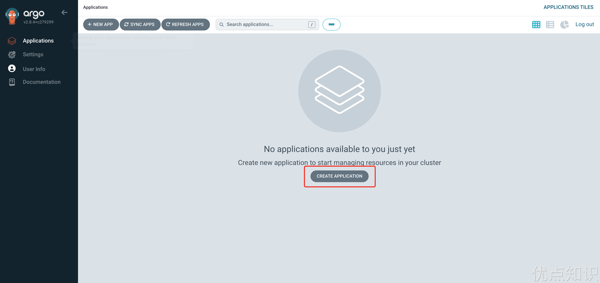

将应用命名为 guestbook，使用 default project，并将同步策略设置为 `Manual`：

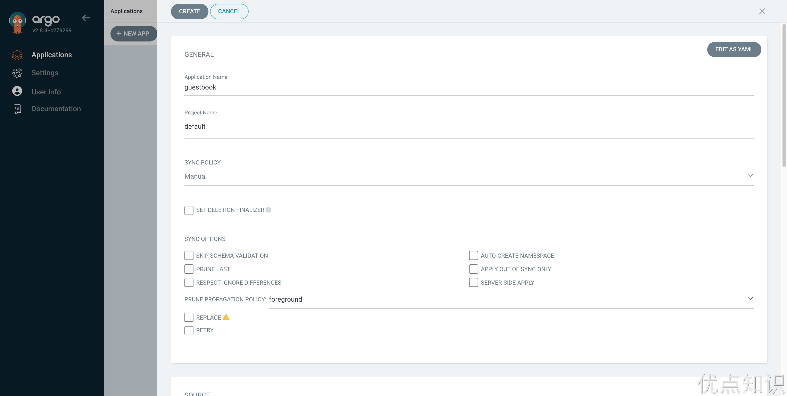

然后在下面配置 `Repository URL` 为 [https://github.com/argoproj/argocd-example-apps.git](https://github.com/argoproj/argocd-example-apps.git)，由于某些原因我们这里使用的是 Gitee 仓库地址 `https://gitee.com/cnych/argocd-example-apps`，将 Revision 设置为 HEAD，并将路径设置为 guestbook。然后下面的 Destination 部分，将 cluster 设置为 `inCluster` 和 namespace 为 default：


填写完以上信息后，点击页面上方的 Create 安装，即可创建 guestbook 应用，创建完成后可以看到当前应用的处于 `OutOfSync` 状态：

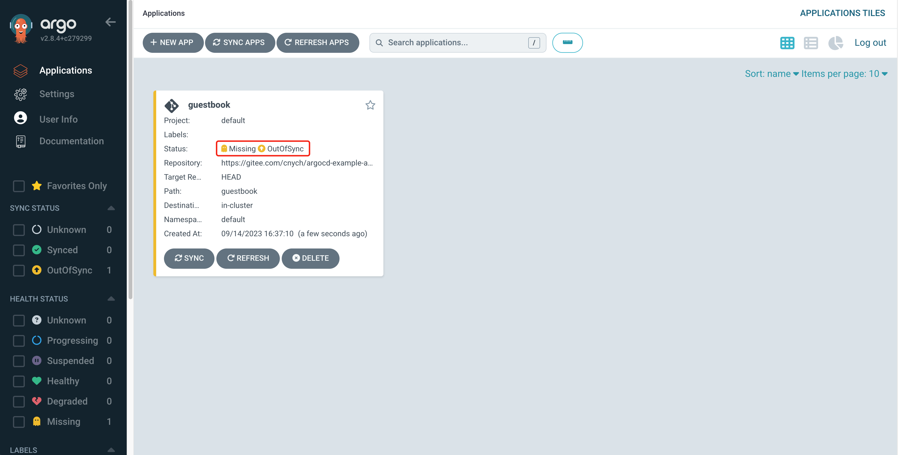

Argo CD 默认情况下每 3 分钟会检测 Git 仓库一次，用于判断应用实际状态是否和 Git 中声明的期望状态一致，如果不一致，状态就转换为 `OutOfSync`。默认情况下并不会触发更新，除非通过 `syncPolicy` 配置了自动同步。


#### 通过 CRD 创建

除了可以通过 CLI 和 Dashboard 可以创建 Application 之外，其实也可以直接通过声明一个 `Application` 的资源对象来创建一个应用，如下所示：

```yaml
apiVersion: argoproj.io/v1alpha1
kind: Application
metadata:
  name: guestbook
spec:
  destination:
    namespace: default
    server: "https://kubernetes.default.svc"
  source:
    path: guestbook
    repoURL: "https://github.com/cnych/argocd-example-apps"
    targetRevision: HEAD
  project: default
  syncPolicy:
    automated: null
```


### 部署应用

由于上面我们在创建应用的时候使用的同步策略为 `Manual`，所以应用创建完成后没有自动部署，需要我们手动去部署应用。同样可以通过 CLI 和 UI 界面两种同步方式。


#### 使用 CLI 同步

应用创建完成后，我们可以通过如下所示命令查看其状态：

```shell
$ argocd app get argocd/guestbook
Name:               argocd/guestbook
Project:            default
Server:             https://kubernetes.default.svc
Namespace:          default
URL:                https://grpc.argocd.k8s.local/applications/guestbook
Repo:               https://gitee.com/cnych/argocd-example-apps
Target:             HEAD
Path:               guestbook
SyncWindow:         Sync Allowed
Sync Policy:        <none>
Sync Status:        OutOfSync from HEAD (f3736e6)
Health Status:      Missing

GROUP  KIND        NAMESPACE  NAME          STATUS     HEALTH   HOOK  MESSAGE
       Service     default    guestbook-ui  OutOfSync  Missing
apps   Deployment  default    guestbook-ui  OutOfSync  Missing
```

应用程序状态为初始 `OutOfSync` 状态，因为应用程序尚未部署，并且尚未创建任何 Kubernetes 资源。要同步（部署）应用程序，可以执行如下所示命令：

```shell
$ argocd app sync argocd/guestbook
```

此命令从 Git 仓库中检索资源清单并执行 `kubectl apply` 部署应用，执行上面命令后 guestbook 应用便会运行在集群中了，现在我们就可以查看其资源组件、日志、事件和评估其健康状态了。


#### 通过 UI 同步

直接添加 UI 界面上应用的 `Sync` 按钮即可开始同步：

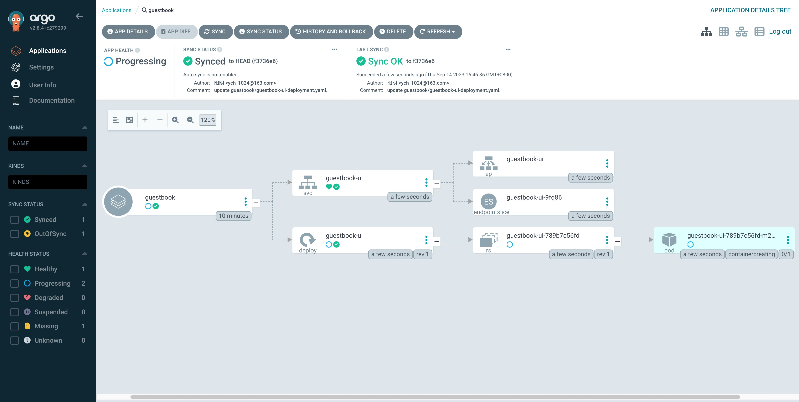

同步完成后可以看到我们的资源状态，甚至还可以直接查看应用的日志信息：


也可以通过 kubectl 查看到我们部署的资源：

```shell
$ kubectl get pods
NAME                                 READY   STATUS      RESTARTS       AGE
guestbook-ui-6c96fb4bdc-bdwh9        1/1     Running     0              3m3s
➜  ~ kubectl get svc
NAME                 TYPE           CLUSTER-IP       EXTERNAL-IP    PORT(S)                      AGE
guestbook-ui         ClusterIP      10.100.170.117   <none>         80/TCP                       3m16s
kubernetes           ClusterIP      10.96.0.1        <none>         443/TCP                      42d
```

和我们从 Git 仓库中同步 `guestbook` 目录下面的资源状态也是同步的，证明同步成功了。

### 流水线改造

前面我们通过 Jenkins Pipeline 已经成功的将应用部署到了集群中了，但是我们使用的是传统的主动 push 方式，接下来我们需要将这个流程改造成为一个 GitOps 的流水线，这样我们就可以通过 Git 来管理应用的部署了。

前面 Jenkins Pipeline 中我们在发布应用的时候是通过 `helm` 方式来部署的，现在我们只需要将流水线的 CD 部分进行改造，比如将镜像构建后推送到镜像仓库，然后去修改 git 仓库中的 values 文件，Argo CD 来同步部署应用即可。

首先我们将应用的部署资源清单单独放一个 config 的仓库下面 [http://gitlab.k8s.local/cnych/k8s-devops-demo-config.git](http://gitlab.k8s.local/cnych/k8s-devops-demo-config.git)，将前面应用的 helm 目录上传到该仓库中。这样方便和 Argo CD 进行对接，整个项目下面只有用于应用部署的 Helm Chart 模板。

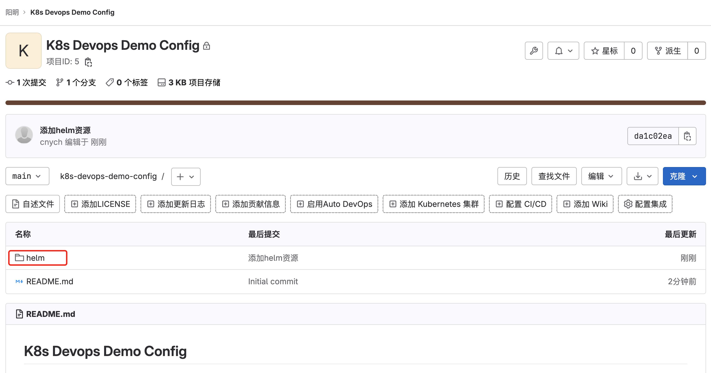

如果有多个团队，每个团队都要维护大量的应用，就需要用到 Argo CD 的另一个概念：项目（Project）。Argo CD 中的项目（Project）可以用来对 Application 进行分组，不同的团队使用不同的项目，这样就实现了多租户环境。项目还支持更细粒度的访问权限控制：

- 限制部署内容（受信任的 Git 仓库）；
- 限制目标部署环境（目标集群和 namespace）；
- 限制部署的资源类型（例如 RBAC、CRD、DaemonSets、NetworkPolicy 等）；
- 定义项目角色，为 Application 提供 RBAC（例如 OIDC group 或者 JWT 令牌绑定）。

比如我们这里创建一个名为 `demo` 的项目，将该应用创建到该项目下，只需创建一个如下所示的 `AppProject` 对象即可：

```yaml
apiVersion: argoproj.io/v1alpha1
kind: AppProject
metadata:
  # 项目名
  name: demo
  namespace: argocd
spec:
  # 目标
  destinations:
    # 此项目的服务允许部署的 namespace，这里为全部
    - namespace: "*"
      # 此项目允许部署的集群，这里为默认集群，即为Argo CD部署的当前集群
      server: https://kubernetes.default.svc
  # 允许的数据源
  sourceRepos:
    - http://gitlab.k8s.local/cnych/k8s-devops-demo-config.git
```

该对象中有几个核心的属性：

- `sourceRepos`：项目中的应用程序可以从中获取清单的仓库引用
- `destinations`：项目中的应用可以部署到的集群和命名空间
- `roles`：项目内资源访问定义的角色

直接创建该对象即可：

```shell
$ kubectl get appproject -n argocd
NAME      AGE
default   47h
demo      6s
```

然后前往 Argo CD 的 `Settings` 页面点击 `+ CONNECT REPO` 添加仓库：

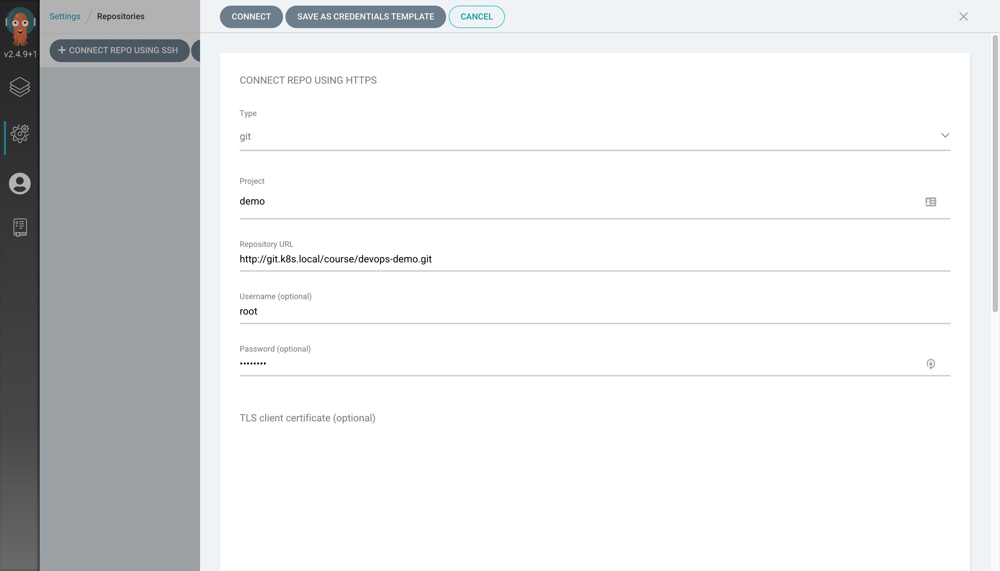

需要注意的是这里的密码需要使用 AccessToken，我们可以前往 GitLab 的页面 [http://gitlab.k8s.local/-/profile/personal_access_tokens](http://gitlab.k8s.local/-/profile/personal_access_tokens) 创建。

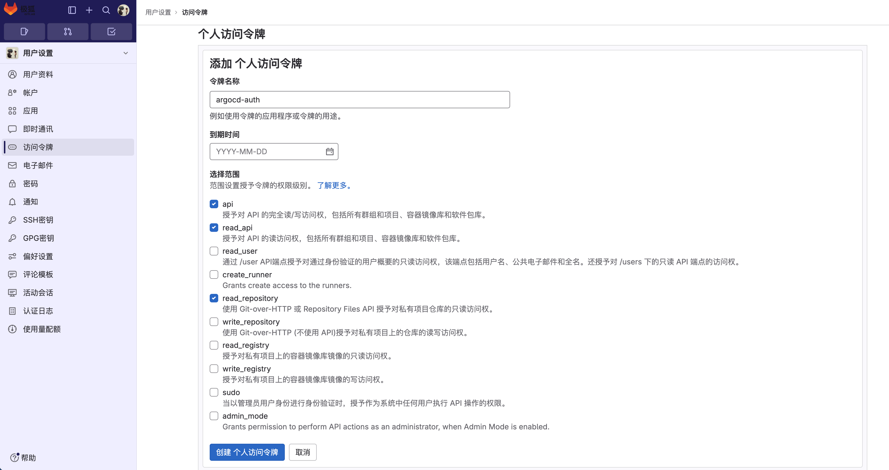

更多配置信息可以前往文档 [https://argo-cd.readthedocs.io/en/stable/operator-manual/declarative-setup/](https://argo-cd.readthedocs.io/en/stable/operator-manual/declarative-setup/) 查看，项目创建完成后，在该项目下创建一个 Application，代表环境中部署的应用程序实例。

```yaml
apiVersion: argoproj.io/v1alpha1
kind: Application
metadata:
  name: devops-demo
  namespace: argocd
spec:
  destination:
    namespace: default
    server: "https://kubernetes.default.svc"
  project: demo
  syncPolicy:
    automated:
      prune: true
      selfHeal: true
  source:
    path: helm # 从 Helm 存储库创建应用程序时，chart 必须指定 path
    repoURL: "http://gitlab.k8s.local/cnych/k8s-devops-demo-config.git"
    targetRevision: HEAD
    helm:
      parameters:
        - name: replicaCount
          value: "2"
      valueFiles:
        - my-values.yaml
```

这里我们定义了一个名为 `devops-demo` 的应用，应用源来自于 helm 路径，使用的是 `my-values.yaml` 文件，此外还可以通过 `source.helm.parameters` 来配置参数。

同步策略可以选择使用自动的方式，该策略下面还有两个属性可以配置：

- `PRUNE RESOURCES`：开启后 Git Repo 中删除资源会自动在环境中删除对应的资源。

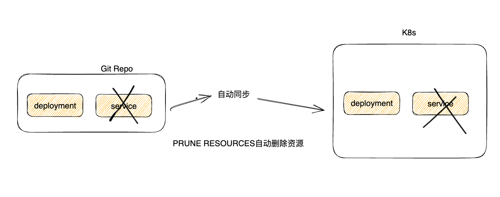

- `SELF HEAL`：自动痊愈，强制以 Git Repo 状态为准，手动在环境中修改不会生效。


正常创建后这个应用会出现 `Degraded` 的错误，这是因为我们 Values 中的镜像默认为 latest，而我们没有将镜像推送到镜像仓库，所以会出现错误。


接下来我们去修改 Jenkins Pipeline 的流水线，将 CD 部分进行修改。

```groovy
podTemplate(cloud: "Kubernetes", nodeSelector: "kubernetes.io/hostname=node2", containers: [
  containerTemplate(name: 'golang', image: 'golang:1.18.3-alpine3.16', command: 'cat', ttyEnabled: true),
  containerTemplate(name: 'docker', image: 'docker:latest', command: 'cat', ttyEnabled: true),
  containerTemplate(name: 'kubectl', image: 'cnych/kubectl', command: 'cat', ttyEnabled: true),
  containerTemplate(name: 'helm', image: 'cnych/helm', command: 'cat', ttyEnabled: true),
  containerTemplate(name: 'yq', image: 'cnych/yq-jq:git', command: 'cat', ttyEnabled: true)
], serviceAccount: 'jenkins', envVars: [
  envVar(key: 'DOCKER_HOST', value: 'tcp://docker-dind:2375')  // 环境变量
]) {
  node(POD_LABEL) {
    def myRepo = checkout scm
    def gitConfigRepo = "gitlab.k8s.local/cnych/k8s-devops-demo-config.git"
    def gitCommit = myRepo.GIT_COMMIT
    def gitBranch = myRepo.GIT_BRANCH

    // 获取 git commit id 作为镜像标签
    def imageTag = sh(script: "git rev-parse --short HEAD", returnStdout: true).trim()
    // 仓库地址
    def registryUrl = "harbor.k8s.local"
    def imageEndpoint = "course/devops-demo"
    // 镜像
    def image = "${registryUrl}/${imageEndpoint}:${imageTag}"

    stage('单元测试') {
      echo "测试阶段"
    }
    stage('代码编译打包') {
        try {
            container('golang') {
            echo "2.代码编译打包阶段"
            sh """
                export GOPROXY=https://goproxy.io
                GOOS=linux GOARCH=amd64 go build -v -o demo-app
                """
            }
        } catch (exc) {
            println "构建失败 - ${currentBuild.fullDisplayName}"
            throw(exc)
        }
    }
    stage('构建 Docker 镜像') {
        withCredentials([[$class: 'UsernamePasswordMultiBinding',
            credentialsId: 'docker-auth',
            usernameVariable: 'DOCKER_USER',
            passwordVariable: 'DOCKER_PASSWORD']]) {
            container('docker') {
                echo "3. 构建 Docker 镜像阶段"
                sh """
                docker login ${registryUrl} -u ${DOCKER_USER} -p ${DOCKER_PASSWORD}
                docker build -t ${image} .
                docker push ${image}
                """
            }
        }
    }
    stage('修改 Config Repo') {
        withCredentials([[$class: 'UsernamePasswordMultiBinding',
            credentialsId: 'gitlab-auth',
            usernameVariable: 'GIT_USER',
            passwordVariable: 'GIT_PASSWORD']]) {
                container('yq') {
                    echo "3. 修改 Config Repo 仓库 Values"
                    // Bed6gAYq
                    sh """
                    git clone http://${GIT_USER}:${GIT_PASSWORD}@${gitConfigRepo}
                    
                    cd k8s-devops-demo-config/helm
    
                    yq e '.image.tag = "${imageTag}"' -i my-values.yaml

                    git add my-values.yaml

                    git config --global user.name "cnych"
                    git config --global user.email "cnych@youdianzhishi.com"

                    git commit -m "update image tag to ${imageTag}"

                    git push http://${GIT_USER}:${GIT_PASSWORD}@${gitConfigRepo}
                    """
                }
        }

    }
    stage('运行 Kubectl') {
        withCredentials([file(credentialsId: 'kubeconfig', variable: 'KUBECONFIG')]) {
            container('kubectl') {
                sh "mkdir -p ~/.kube && cp ${KUBECONFIG} ~/.kube/config"
                echo "5.查看应用"
                sh "kubectl get all -n kube-ops -l app=devops-demo"
            }
        }
    }

  }
}
```

上面的流水线中我们在应用构建成镜像后，直接去修改了 Config Repo 仓库中的 values 文件，然后提交到仓库中，这样 Argo CD 就会自动同步部署应用了。

由于 Argo CD 默认并不是实时去监测 Config Repo 的变化的，如果要更快的检测到变化我们可以使用 Git Webhook 的方式。

默认情况下 Argo CD 每三分钟轮询一次 Git 存储库，以检测清单的更改。为了消除轮询延迟，可以将 API 服务器配置为接收 Webhook 事件。Argo CD 支持来自 GitHub、GitLab、Bitbucket、Bitbucket Server 和 Gogs 的 Git webhook 通知。

同样方式我们可以在 `k8s-devops-demo-config` 仓库下面创建一个 Webhook，Git 提供程序中配置的有效负载 URL 应使用 Argo CD 实例的 `/api/webhook` 端点（例如 `https://argocd.example.com/api/webhook`）。


然后在 `argocd-secret` 这个 Kubernetes Secret 中，使用上面配置的 Git 提供商的 Webhook 密钥配置以下密钥之一。


```bash
$ kubectl edit secret argocd-secret -n argocd
apiVersion: v1
kind: Secret
metadata:
  name: argocd-secret
  namespace: argocd
type: Opaque
data:
...

stringData:
  # github webhook secret
  webhook.github.secret: shhhh! it's a GitHub secret

  # gitlab webhook secret
  webhook.gitlab.secret: shhhh! it's a GitLab secret

  # bitbucket webhook secret
  webhook.bitbucket.uuid: your-bitbucket-uuid

  # bitbucket server webhook secret
  webhook.bitbucketserver.secret: shhhh! it's a Bitbucket server secret

  # gogs server webhook secret
  webhook.gogs.secret: shhhh! it's a gogs server secret
```

可以直接使用 `stringData` 来配置 secret，这样就不用去手动编码了。


因为 GitOps 的核心是 Git，所以我们一定要将部署到集群中的资源清单文件全都托管到 Git 仓库中，这样才能实现 GitOps 的自动同步部署。上面我们是在 CI 流水线中去修改 Git 仓库中的资源清单文件，其实我们也可以通过其他方式去修改，比如 Argo CD 也提供了一个新的工具 [Argo CD Image Updater](https://argocd-image-updater.readthedocs.io/en/stable/)。


### Argo CD Image Updater

`Argo CD Image Updater` 是一种自动更新由 Argo CD 管理的 Kubernetes 工作负载的容器镜像的工具。
该工具可以检查与 Kubernetes 工作负载一起部署的容器镜像的新版本，并使用 Argo CD 自动将其更新到允许的最新版本。它通过为 Argo CD 应用程序设置适当的应用程序参数来工作，类似于 `argocd app set --helm-set image.tag=v1.0.1`，但以完全自动化的方式。

Argo CD Image Updater 会定期轮询 Argo CD 中配置的应用程序，并查询相应的镜像仓库以获取可能的新版本。如果在仓库中找到新版本的镜像，并且满足版本约束，Argo CD 镜像更新程序将指示 Argo CD 使用新版本的镜像更新应用程序。

根据您的应用程序自动同步策略，Argo CD 将自动部署新的镜像版本或将应用程序标记为不同步，您可以通过同步应用程序来手动触发镜像更新。

**特征**

- 更新由 Argo CD 管理且由 Helm 或 Kustomize 工具生成的应用程序镜像
- 根据不同的更新策略更新应用镜像 
   - semver：根据给定的镜像约束更新到允许的最高版本
   - latest：更新到最近创建的镜像标签
   - name：更新到按字母顺序排序的列表中的最后一个标签
   - digest：更新到可变标签的最新推送版本
- 支持广泛使用的容器镜像仓库
- 通过配置支持私有容器镜像仓库
- 可以将更改写回 Git
- 能够使用匹配器函数过滤镜像仓库返回的标签列表
- 在 Kubernetes 集群中运行，或者可以从命令行独立使用
- 能够执行应用程序的并行更新

另外需要注意的是使用该工具目前有几个限制：

- 想要更新容器镜像的应用程序必须使用 Argo CD 进行管理。不支持未使用 Argo CD 管理的工作负载。
- Argo CD 镜像更新程序只能更新其清单使用 Kustomize 或 Helm 呈现的应用程序的容器镜像，特别是在 Helm 的情况下，模板需要支持使用参数（即`image.tag`）。
- 镜像拉取密钥必须存在于 Argo CD Image Updater 运行（或有权访问）的同一 Kubernetes 集群中。目前无法从其他集群获取这些机密信息。

**安装**

建议在运行 Argo CD 的同一个 Kubernetes 命名空间集群中运行 Argo CD Image Updater，但这不是必需的。事实上，甚至不需要在 Kubernetes 集群中运行 Argo CD Image Updater 或根本不需要访问任何 Kubernetes 集群。但如果不访问 Kubernetes，某些功能可能无法使用，所以强烈建议使用第一种安装方法。

运行镜像更新程序的最直接方法是将其作为 Kubernetes 工作负载安装到运行 Argo CD 的命名空间中。这样就不需要任何配置，也不会对你的工作负载产生任何影响。

```bash
kubectl apply -n argocd -f https://raw.githubusercontent.com/argoproj-labs/argocd-image-updater/stable/manifests/install.yaml
```

`Argo CD Image Updater` 安装完成后我们就可以直接去监听镜像是否发生了变化，而不需要在 CI 流水线中去手动提交修改资源清单到代码仓库了。

现在我们可以先去删除前面的 app：

```bash
$ argocd app delete devops-demo --cascade
Are you sure you want to delete 'devops-demo' and all its resources? [y/n] y
application 'devops-demo' deleted
```

然后接下来创建一个新的 Application 对象，对应的资源清单如下所示：

```yaml
# demo-app2.yaml
apiVersion: argoproj.io/v1alpha1
kind: Application
metadata:
  name: devops-demo2
  annotations:
    argocd-image-updater.argoproj.io/image-list: myalias=cnych/devops-demo # Write repository name
    argocd-image-updater.argoproj.io/myalias.allow-tags: regexp:^.*$
    argocd-image-updater.argoproj.io/myalias.pull-secret: pullsecret:argocd/dockerhub-secret
    argocd-image-updater.argoproj.io/myalias.update-strategy: latest # There are several ways to update the image, but I'm using digest.
    argocd-image-updater.argoproj.io/write-back-method: git
    argocd-image-updater.argoproj.io/git-branch: main
    argocd-image-updater.argoproj.io/myalias.force-update: "true"
  namespace: argocd
spec:
  destination:
    namespace: argocd
    server: https://kubernetes.default.svc
  project: demo
  source:
    path: helm # 从 Helm 存储库创建应用程序时，chart 必须指定 path
    repoURL: http://gitlab.k8s.local/cnych/k8s-devops-demo-config.git
    targetRevision: main
    helm:
      parameters:
        - name: replicaCount
          value: "2"
      valueFiles:
        - my-values.yaml
  syncPolicy:
    automated:
      prune: true
      selfHeal: true
    syncOptions:
      - CreateNamespace=true
```

这个新的资源对象中，我们添加了一些注释，这些注释用于配置 Argo CD Image Updater。这些配置用于指定自动更新容器镜像的策略、参数和相关信息。以下是对这些注释的详细解释：

- `argocd-image-updater.argoproj.io/image-list`: 这个注解定义了应用中使用的镜像列表。
- `argocd-image-updater.argoproj.io/allow-tags`: 这个注解指定了允许更新的镜像标签，可以使用正则表达式的方式。-
- `argocd-image-updater.argoproj.io/<alias>.pull-secret`: 这个注解指定了用于拉取镜像的 Secret。
- `argocd-image-updater.argoproj.io/update-strategy`: 这个注解定义了镜像更新策略。这里的值是 `latest`，表示使用最新的镜像标签进行更新，还可以指定的值包括：digest、name、semver。
- `argocd-image-updater.argoproj.io/write-back-method`: 这个注解定义了更新后的配置写回方法。`git` 表示将更新后的配置写回到 Git 仓库。
- `argocd-image-updater.argoproj.io/git-branch`：这个注解定义了更新后的配置写回到 Git 仓库的分支。

注意上面我们配置了一个 `pull-secret` 的注解，如果使用的是 docker hub，需要在个人中心去创建一个 access token：

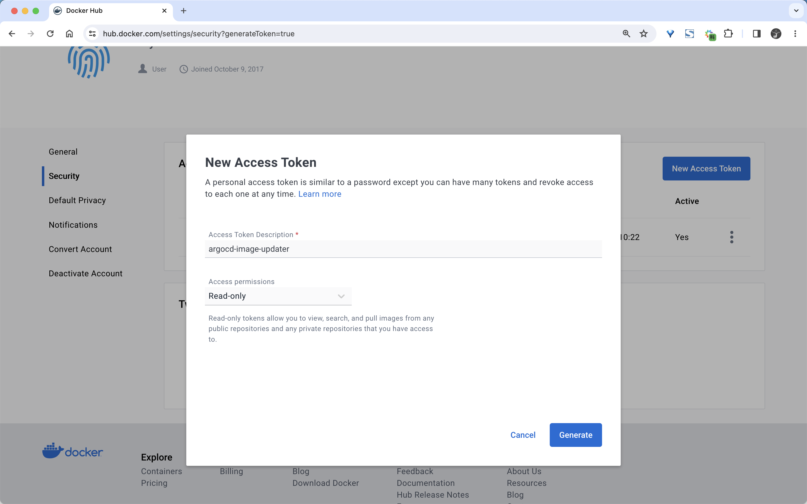

然后使用如下命令创建一个 secret：

```bash
kubectl create -n argocd secret docker-registry dockerhub-secret \
  --docker-username xxxx \
  --docker-password xxxx \
  --docker-server "https://registry-1.docker.io"
```

然后我们就可以创建这个应用了：

```bash
$ kubectl apply -f demo-app2.yaml
```

创建后正常第一次会去同步部署应用。然后接下来我们可以去修改 Jenkins Pipeline 的流水线，只需要保留到镜像构建的部分即可，其他的部分都可以去掉了。

```groovy
podTemplate(cloud: "Kubernetes", containers: [
  containerTemplate(name: 'golang', image: 'golang:1.18.3-alpine3.16', command: 'cat', ttyEnabled: true),
  containerTemplate(name: 'docker', image: 'docker:latest', command: 'cat', ttyEnabled: true),
  containerTemplate(name: 'kubectl', image: 'cnych/kubectl', command: 'cat', ttyEnabled: true)
], serviceAccount: 'jenkins', envVars: [
  envVar(key: 'DOCKER_HOST', value: 'tcp://docker-dind:2375')  // 环境变量
]) {
  node(POD_LABEL) {
    def myRepo = checkout scm
    def gitCommit = myRepo.GIT_COMMIT
    def gitBranch = myRepo.GIT_BRANCH

    // 获取 git commit id 作为镜像标签
    def imageTag = sh(script: "git rev-parse --short HEAD", returnStdout: true).trim()
    // 仓库地址
    def registryUrl = "docker.io"
    def imageEndpoint = "cnych/devops-demo"
    // 镜像
    def image = "${registryUrl}/${imageEndpoint}:${imageTag}"

    stage('单元测试') {
      echo "测试阶段"
    }
    stage('代码编译打包') {
        try {
            container('golang') {
            echo "2.代码编译打包阶段"
            sh """
                export GOPROXY=https://goproxy.io
                GOOS=linux GOARCH=amd64 go build -v -o demo-app
                """
            }
        } catch (exc) {
            println "构建失败 - ${currentBuild.fullDisplayName}"
            throw(exc)
        }
    }
    stage('构建 Docker 镜像') {
        withCredentials([[$class: 'UsernamePasswordMultiBinding',
            credentialsId: 'docker-auth',
            usernameVariable: 'DOCKER_USER',
            passwordVariable: 'DOCKER_PASSWORD']]) {
            container('docker') {
                echo "3. 构建 Docker 镜像阶段"
                sh """
                docker login ${registryUrl} -u ${DOCKER_USER} -p ${DOCKER_PASSWORD}
                docker build -t ${image} .
                docker push ${image}
                """
            }
        }
    }
}
```

重新提交上面的流水线过后，最终我们会将应用镜像推送到镜像仓库中去。

然后 `Argo CD Image Updater` 将会每 2 分钟从镜像仓库去检索镜像版本变化，一旦发现有新的镜像版本，它将自动使用新版本来更新集群内工作负载的镜像，并将镜像版本回写到 Git 仓库重去。我们可以去查看 Argo CD Image Updater 的日志变化：

```bash
$ kubectl logs -f argocd-image-updater-56d94c674d-npgqp -n argocd
# ......
time="2023-09-19T06:39:12Z" level=info msg="Starting image update cycle, considering 1 annotated application(s) for update"
time="2023-09-19T06:39:16Z" level=info msg="Setting new image to cnych/devops-demo:a6268b3" alias=myalias application=devops-demo2 image_name=cnych/devops-demo image_tag=739a588 registry=
time="2023-09-19T06:39:16Z" level=info msg="Successfully updated image 'cnych/devops-demo:739a588' to 'cnych/devops-demo:a6268b3', but pending spec update (dry run=false)" alias=myalias application=devops-demo2 image_name=cnych/devops-demo image_tag=739a588 registry=
time="2023-09-19T06:39:16Z" level=info msg="Committing 1 parameter update(s) for application devops-demo2" application=devops-demo2
time="2023-09-19T06:39:16Z" level=info msg="Starting configmap/secret informers"
time="2023-09-19T06:39:17Z" level=info msg="Configmap/secret informer synced"
time="2023-09-19T06:39:17Z" level=info msg="Initializing http://gitlab.k8s.local/cnych/k8s-demo-config.git to /tmp/git-devops-demo23205764981"
time="2023-09-19T06:39:17Z" level=info msg="rm -rf /tmp/git-devops-demo23205764981" dir= execID=14972
time="2023-09-19T06:39:17Z" level=info msg="secrets informer cancelled"
time="2023-09-19T06:39:17Z" level=info msg="configmap informer cancelled"
time="2023-09-19T06:39:17Z" level=info msg=Trace args="[rm -rf /tmp/git-devops-demo23205764981]" dir= operation_name="exec rm" time_ms=4.474982
time="2023-09-19T06:39:17Z" level=info msg="git fetch origin --tags --force" dir=/tmp/git-devops-demo23205764981 execID=08213
time="2023-09-19T06:39:17Z" level=info msg=Trace args="[git fetch origin --tags --force]" dir=/tmp/git-devops-demo23205764981 operation_name="exec git" time_ms=492.78976600000004
time="2023-09-19T06:39:17Z" level=info msg="git config user.name argocd-image-updater" dir=/tmp/git-devops-demo23205764981 execID=35e12
time="2023-09-19T06:39:17Z" level=info msg=Trace args="[git config user.name argocd-image-updater]" dir=/tmp/git-devops-demo23205764981 operation_name="exec git" time_ms=1.4469750000000001
time="2023-09-19T06:39:17Z" level=info msg="git config user.email noreply@argoproj.io" dir=/tmp/git-devops-demo23205764981 execID=6515c
time="2023-09-19T06:39:17Z" level=info msg=Trace args="[git config user.email noreply@argoproj.io]" dir=/tmp/git-devops-demo23205764981 operation_name="exec git" time_ms=1.593801
time="2023-09-19T06:39:17Z" level=info msg="git checkout --force main" dir=/tmp/git-devops-demo23205764981 execID=e5492
time="2023-09-19T06:39:17Z" level=info msg=Trace args="[git checkout --force main]" dir=/tmp/git-devops-demo23205764981 operation_name="exec git" time_ms=5.05169
time="2023-09-19T06:39:17Z" level=info msg="git clean -fdx" dir=/tmp/git-devops-demo23205764981 execID=5cca4
time="2023-09-19T06:39:17Z" level=info msg=Trace args="[git clean -fdx]" dir=/tmp/git-devops-demo23205764981 operation_name="exec git" time_ms=1.8230989999999998
time="2023-09-19T06:39:17Z" level=info msg="git commit -a -F /tmp/image-updater-commit-msg2911699728" dir=/tmp/git-devops-demo23205764981 execID=ac1b3
time="2023-09-19T06:39:17Z" level=info msg=Trace args="[git commit -a -F /tmp/image-updater-commit-msg2911699728]" dir=/tmp/git-devops-demo23205764981 operation_name="exec git" time_ms=7.143674
time="2023-09-19T06:39:17Z" level=info msg="git push origin main" dir=/tmp/git-devops-demo23205764981 execID=136ad
time="2023-09-19T06:39:18Z" level=info msg=Trace args="[git push origin main]" dir=/tmp/git-devops-demo23205764981 operation_name="exec git" time_ms=874.7453360000001
time="2023-09-19T06:39:18Z" level=info msg="Successfully updated the live application spec" application=devops-demo2
time="2023-09-19T06:39:18Z" level=info msg="Processing results: applications=1 images_considered=1 images_skipped=0 images_updated=1 errors=0"
time="2023-09-19T06:41:18Z" level=info msg="Starting image update cycle, considering 1 annotated application(s) for update"
time="2023-09-19T06:41:21Z" level=info msg="Processing results: applications=1 images_considered=1 images_skipped=0 images_updated=0 errors=0"
time="2023-09-19T06:43:21Z" level=info msg="Starting image update cycle, considering 1 annotated application(s) for update"
# ......
```

另外需要注意的是在回写时，`ArgoCD Image Updater` 并不会直接修改仓库的 `values.yaml` 文件，而是会创建一个专门用于覆盖 Helm Chart `values.yaml` 的 `.argocd-source-devops-demo2.yaml` 文件。

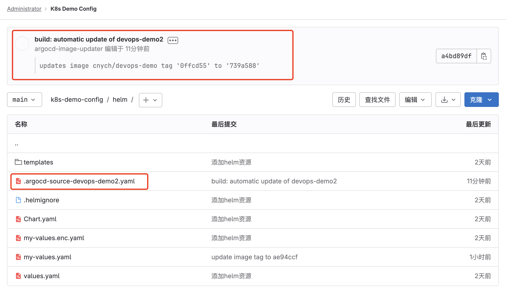

自动提交变更后，Argo CD 就会自动同步部署应用了。

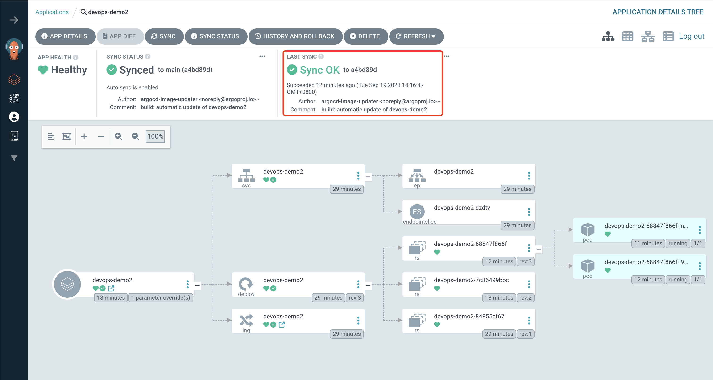


> 原文: <https://www.yuque.com/cnych/k8s4/hy2qavrvn8xohguz>